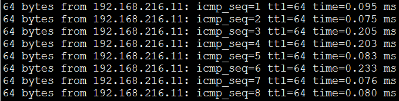
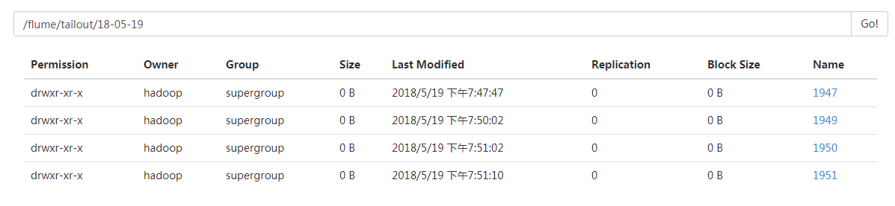
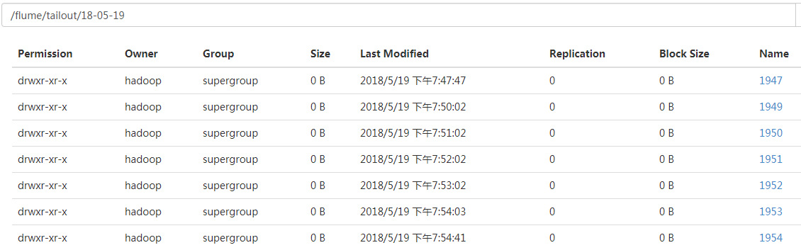
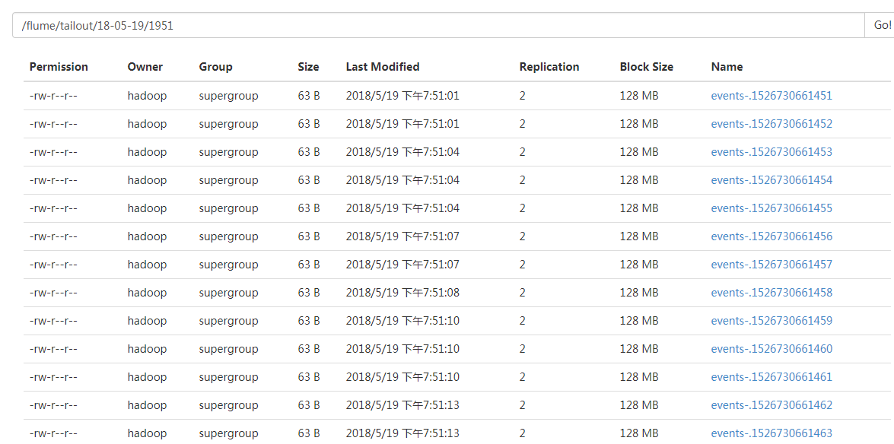

#### flume案例：exec-memory-hdfs

- 配置sources,channels,sinks

  ```
  ##首先在flume-1.6.0/agentconf文件夹下创建配置文件：exec-hdfs.conf
  vi exec-hdfs.conf
  # Name the components on this agent
  a1.sources = r1
  a1.sinks = k1
  a1.channels = c1
  # Describe/configure the source
  a1.sources.r1.type = exec
  a1.sources.r1.command = tail -F /home/hadoop/testData/flumedata/test.dat
  # Describe the sink
  a1.sinks.k1.type = hdfs
  a1.sinks.k1.hdfs.path = hdfs://192.168.216.11:9000/flume/tailout/%y-%m-%d/%H%M/			#将数据下沉到hdfs系统中
  a1.sinks.k1.hdfs.filePrefix = events-
  a1.sinks.k1.hdfs.round = true
  a1.sinks.k1.hdfs.roundValue = 10
  a1.sinks.k1.hdfs.roundUnit = second
  a1.sinks.k1.hdfs.rollInterval = 3
  a1.sinks.k1.hdfs.rollSize = 20
  a1.sinks.k1.hdfs.rollCount = 5
  a1.sinks.k1.hdfs.batchSize = 1
  a1.sinks.k1.hdfs.useLocalTimeStamp = true
  a1.sinks.k1.hdfs.fileType = DataStream #生成时间文件
  # Use a channel which buffers events in memory
  a1.channels.c1.type = memory	#表示内存
  a1.channels.c1.capacity = 1000
  a1.channels.c1.transactionCapacity = 100
  # Bind the source and sink to the channel
  a1.sources.r1.channels = c1
  a1.sinks.k1.channel = c1
  ```

  注意：

  tail -F ：表示跟踪文件的改变

  filePrefix:表示文件跟什么样的前缀

  round：为true时表示目录的下沉

  roundValue：与roundUnit连用，表示几秒钟下沉一个目录

  roundUnit：可跟second

  rollInterval：表示每3秒下沉一个文件

  rollSize：表示到达的字节数达到一定字节的时候下沉一个文件

  rollCount：当有几个event到达的时候就下沉一个文件

  batchSize：批处理

  useLocalTimeStamp：时间戳

- 开启agent

  ```
  bin/flume-ng agent -c ./conf -f agentconf/exec-hdfs.conf -n a1 -Dflume.root.logger=INFO,console
  ```

- 测试

  ```
  #表示将ping该IP的信息一直写到该文件中
  ping 192.168.216.11 >> /home/hadoop/testData/flumedata/test.dat
  ```
  test.dat中局部数据：

  

- 查看结果


hdfs系统中产生的文件夹：



一段时间后，文件夹在增多：



每个文件夹中都有类似的文件生成：

