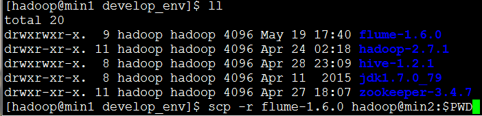
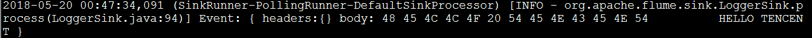
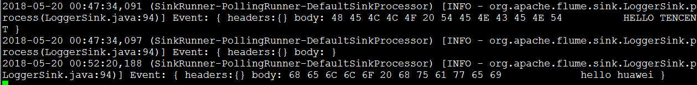

##### flume案例：两级串联

将主机min1作为客户端：用tail命令监听目标文件的变化，并将数据发送到主机min2的avro端口

然后将主机min2作为客户端：获取主机min1发送到本机的avro端口的数据，并将数据下沉到logger

注意：由于我的min2上没有flume安装包，所以先将min1上的flume安装包分发到min2上



- ##### 分别配置主机min1和min2的采集文件

  ##### 1.配置min1上的采集文件

  ```
  vi tail-avro.conf 
  #给sources,sinks,channels起名字
  a1.sources = r1
  a1.sinks = k1
  a1.channels = c1
  #配置sources的属性
  a1.sources.r1.type = exec
  a1.sources.r1.command = tail -F /home/hadoop/testData/flumedata/test.dat  ##tail -F表示监听该文件的数据变化
  a1.sources.r1.channels=c1
  #配置sinks的属性
  a1.sinks.k1.type = avro
  a1.sinks.k1.channel=c1
  a1.sinks.k1.hostname=min2  ##表示下沉目标为主机min2的6666端口
  a1.sinks.k1.port=6666
  a1.sinks.k1.batch-size=2
  #配置channles的属性
  a1.channels.c1.type=memory
  a1.channels.c1.capacity=1000
  a1.channels.c1.transactionCapacity=100
  #将channel与sources,sinks联系起来
  a1.sources.r1.channels=c1
  a1.sinks.k1.channel=c1
  ```

  ##### 2.配置min2上的采集文件

  ```
  vi avro-logger.conf 
  #给sources,sinks,channels起名字
  a1.sources=r1
  a1.channels=c1
  a1.sinks=k1
  #配置sources的属性
  a1.sources.r1.type=avro
  a1.sources.r1.channels=c1
  a1.sources.r1.bind=192.168.216.12   ##min2的IP
  a1.sources.r1.port=6666
  #配置sinks的属性
  a1.sinks.k1.type=logger
  #配置channles的属性
  a1.channels.c1.type=memory
  a1.channels.c1.capacity=1000
  a1.channels.c1.transactionCapacity=100
  #将channel与sources,sinks联系起来
  a1.sources.r1.channels=c1
  a1.sinks.k1.channel=c1
  ```

- ##### 依次开启min2,min1的agent

  因为此时min2用于接收从min1传输过来的数据，因此min2为服务器端的角色，min1为客户端的角色，所以先开启min2的agent，后开启min1的

  ```
  #开启min2的agent
  bin/flume-ng agent -c ./conf -f agentconf/avro-logger.conf -n a1 -Dflume.root.logger=INFO,console
  ```

  ```
  #开启min1的agent
  bin/flume-ng agent -c ./conf -f agentconf/tail-avro.conf -n a1 -Dflume.root.logger=INFO,console
  ```

  其实此时min2的agent已经能够接收到min1传送过来的数据了：

  

- ##### 从客户端（min1）发送数据，并查看服务器端（min2）的接收情况

给文件test.dat中添加数据：

```
[hadoop@min1 flumedata]$ echo 'hello huawei' >> test.dat
```

主机min2的接收情况（此时将第二条数据打印出）：



