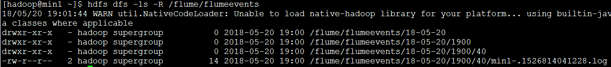
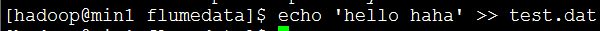
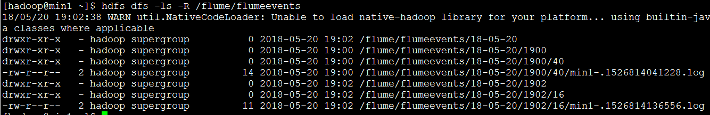
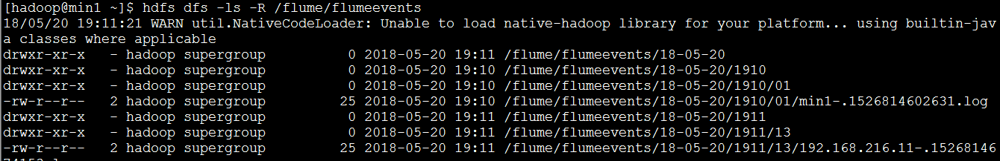

#### flume案例：拦截器

拦截器可对于sources源传入的数据进行自定义获取和对于sinks端传出数据进行自定义输出

1. ##### 配置采集文件

   ```
   #创建配置采集文件
   vi ts.conf
   #给sources,sinks,channels起名字
   a1.sources=r1
   a1.channels=c1
   a1.sinks=s1
   #配置sources属性
   a1.sources.r1.type=exec
   a1.sources.r1.command=tail -f /home/hadoop/testData/flumedata/test.dat  ##tail -f表示一直监听本地文件
   a1.sources.r1.interceptors=i1 i2 i3  ##拦截器名字
   a1.sources.r1.interceptors.i1.type=timestamp##时间戳
   a1.sources.r1.interceptors.i1.preserveExisting=true##表示如果存在就替换它
   a1.sources.r1.interceptors.i2.type=host ##主机
   a1.sources.r1.interceptors.i2.useIP=false  ##false:主机名字  true:显示的是ip地址
   a1.sources.r1.interceptors.i2.hostHeader=hostname ##定义变量，，配合%{hostname}-的使用
   a1.sources.r1.interceptors.i2.preserveExisting=true
   a1.sources.r1.interceptors.i3.type=static  ##静态拦截器，自己指定key和value
   a1.sources.r1.interceptors.i3.key=city
   a1.sources.r1.interceptors.i3.value=NEW_YORK
   #配置channels属性
   a1.channels.c1.type=memory
   a1.channels.c1.capacity=1000
   a1.channels.c1.transactionCapacity=100
   a1.channels.c1.keep-alive=3
   a1.channels.c1.byteCapacityBufferPercentage = 20
   a1.channels.c1.byteCapacity = 800000
   #配置sinks属性
   a1.sinks.s1.type = hdfs
   a1.sinks.s1.hdfs.path = /flume/flumeevents/%y-%m-%d/%H%M/%S
   a1.sinks.s1.hdfs.filePrefix = %{hostname}- ##使用该种方式作为文件头
   a1.sinks.s1.hdfs.fileSuffix=.log   ##使用这种方式作为文件尾
   a1.sinks.s1.hdfs.inUseSuffix=.tmp  
   a1.sinks.s1.hdfs.rollInterval=2
   a1.sinks.s1.hdfs.rollSize=1024
   a1.sinks.s1.hdfs.fileType=DataStream
   a1.sinks.s1.hdfs.writeFormat=Text
   a1.sinks.s1.hdfs.round = true
   a1.sinks.s1.hdfs.roundValue = 1
   a1.sinks.s1.hdfs.roundUnit = second
   a1.sinks.s1.hdfs.useLocalTimeStamp=false
   #将channles与sinks，sources联系起来
   a1.sources.r1.channels=c1
   a1.sinks.s1.channel=c1
   ```

2. ##### 开启agent

   ```
   bin/flume-ng agent -c ./conf -f agentconf/ts.conf -n a1 -Dflume.root.logger=INFO,console
   ```

3. ##### 测试并查看输出结果

   - 当a1.sources.r1.interceptors.i2.useIP=false的时候，生成文件信息：(注意：生成的文件都是min-开头)

   一开始生成文件信息：

   

   向监控文件中追加信息：



第二次生成的文件信息：



- 当a1.sources.r1.interceptors.i2.useIP=true的时候



文件的开头原来是min-，变成了IP地址