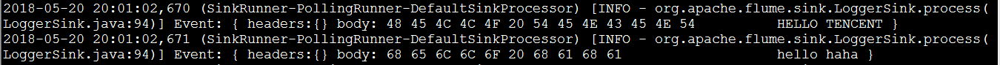
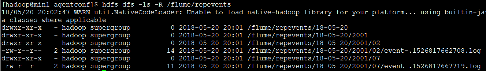

#### flume案例：复制选择器

1. ##### 创建采集文件

   ```
   #创建文件，并配置sources,sinks,channels的属性
   vi exec-hdfs-logger.conf
   #给sources,sinks,channels起名字
   a1.sources=r1		##一个sources可以对应多个管道
   a1.channels=c1 c2	##定义两个管道
   a1.sinks=s1 s2		##由于一个sink只能对应一个管道，因此定义了两个sink
   #配置sources属性
   a1.sources.r1.type=exec
   a1.sources.r1.command=tail -f /home/hadoop/testData/flumedata/test.dat
   a1.sources.r1.selector.type=replicating  ##定义复制选择器
   a1.sources.r1.selector.optional=c2 ##选择器对应c2这个管道
   #配置管道c1属性
   a1.channels.c1.type=memory
   a1.channels.c1.capacity=1000
   a1.channels.c1.transactionCapacity=100
   a1.channels.c1.keep-alive=3
   a1.channels.c1.byteCapacityBufferPercentage=20
   a1.channels.c1.byteCapacity=800000
   #配置管道c2属性
   a1.channels.c2.type=memory
   a1.channels.c2.capacity=1000
   a1.channels.c2.transactionCapacity=100
   a1.channels.c2.keep-alive=3
   a1.channels.c2.byteCapacityBufferPercentage=20
   a1.channels.c2.byteCapacity=800000
   #配置下沉s1属性：下沉到日志中
   a1.sinks.s1.type = logger
   #配置下沉s2属性：下沉到hdfs文件中
   a1.sinks.s2.type = hdfs
   a1.sinks.s2.hdfs.path = /flume/repevents/%y-%m-%d/%H%M/%S
   a1.sinks.s2.hdfs.filePrefix = event-
   a1.sinks.s2.hdfs.fileSuffix=.log
   a1.sinks.s2.hdfs.inUseSuffix=.tmp
   a1.sinks.s2.hdfs.rollInterval=2
   a1.sinks.s2.hdfs.rollSize=1024
   a1.sinks.s2.hdfs.fileType=DataStream
   a1.sinks.s2.hdfs.writeFormat=Text
   a1.sinks.s2.hdfs.round = true
   a1.sinks.s2.hdfs.roundValue = 1
   a1.sinks.s2.hdfs.roundUnit = second
   a1.sinks.s2.hdfs.useLocalTimeStamp=true
   #将channel与sinks,sources联系起来
   a1.sources.r1.channels=c1 c2  ##一个source可以对应多个管道
   a1.sinks.s1.channel=c1 ##一个sink只能对应一个管道
   a1.sinks.s2.channel=c2
   ```

2. ##### 开启agent

   ```
   bin/flume-ng agent -c ./conf/ -f ./agentconf/exec-hdfs-logger.conf -n a1 -Dflume.root.logger=INFO,console
   ```

3. ##### 测试并显示结果

1.结果下沉到logger



2.结果下沉到hdfs生成文件中

