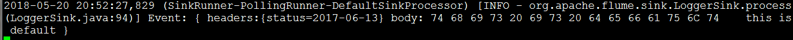
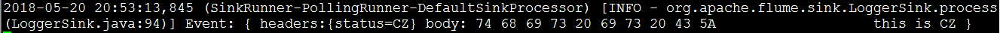
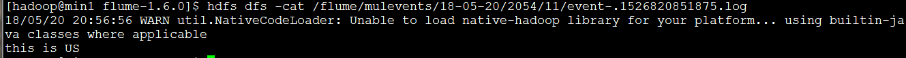

#### flume案例：复分选择器

1. ##### 创建采集文件并配置

```
#创建文件
vi mul.conf
#给sources,sinks,channels起名字
a1.sources=r1
a1.channels=c1 c2	
a1.sinks=s1 s2	
#配置sources属性
a1.sources.r1.type=org.apache.flume.source.http.HTTPSource##表示接收来自网络的数据
a1.sources.r1.port=6666 ##绑定监听端口
a1.sources.r1.bind=min1	##绑定监听主机
a1.sources.r1.selector.type=multiplexing ##设置复分选择器
a1.sources.r1.selector.header=status	##数据头：status
a1.sources.r1.selector.mapping.CZ=c1	##当status=CZ时候，数据通过管道c1传输
a1.sources.r1.selector.mapping.US=c2	##当status=US时候，数据通过管道c2传输
a1.sources.r1.selector.default=c1       ##当status为其它值时，数据也通过管道c1传输
#设置管道c1属性
a1.channels.c1.type=memory
a1.channels.c1.capacity=1000
a1.channels.c1.transactionCapacity=100
a1.channels.c1.keep-alive=3
a1.channels.c1.byteCapacityBufferPercentage = 20
a1.channels.c1.byteCapacity = 800000
#设置管道c2属性
a1.channels.c2.type=memory
a1.channels.c2.capacity=1000
a1.channels.c2.transactionCapacity=100
a1.channels.c2.keep-alive=3
a1.channels.c2.byteCapacityBufferPercentage = 20
a1.channels.c2.byteCapacity = 800000
#设置s1下沉到logger(就是打印到控制台并将数据写进日志)
a1.sinks.s1.type = logger
#设置s2将数据下沉到hdfs系统文件中
a1.sinks.s2.type = hdfs
a1.sinks.s2.hdfs.path = /flume/mulevents/%y-%m-%d/%H%M/%S
a1.sinks.s2.hdfs.filePrefix = event-
a1.sinks.s2.hdfs.fileSuffix=.log
a1.sinks.s2.hdfs.inUseSuffix=.tmp
a1.sinks.s2.hdfs.rollInterval=2
a1.sinks.s2.hdfs.rollSize=1024
a1.sinks.s2.hdfs.fileType=DataStream
a1.sinks.s2.hdfs.writeFormat=Text
a1.sinks.s2.hdfs.round = true
a1.sinks.s2.hdfs.roundValue = 1
a1.sinks.s2.hdfs.roundUnit = second
a1.sinks.s2.hdfs.useLocalTimeStamp=true
#将管道分别和sinks,sources联系起来
a1.sources.r1.channels=c1 c2
a1.sinks.s1.channel=c1
a1.sinks.s2.channel=c2
```

##### 2.启动agent

```
bin/flume-ng agent -c ./conf/ -f ./agentconf/mul.conf -n a1 -Dflume.root.logger=INFO,console
```

##### 3.测试并查看结果

```
curl -X POST -d '[{"headers":{"status":"2017-06-13"},"body":"this is default"}]' http://min1:6666
```

测试结果（打印到控制台）：



```
curl -X POST -d '[{"headers":{"status":"CZ"},"body":"this is CZ"}]' http://min1:6666
```

测试结果（打印到控制台）：



```
curl -X POST -d '[{"headers":{"status":"US"},"body":"this is US"}]' http://min1:6666
```

测试结果（数据下沉到hdfs系统的生成文件中）：

