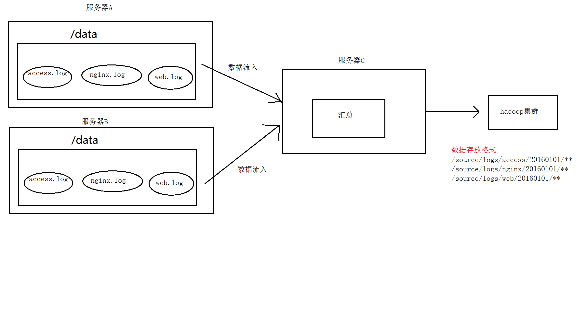
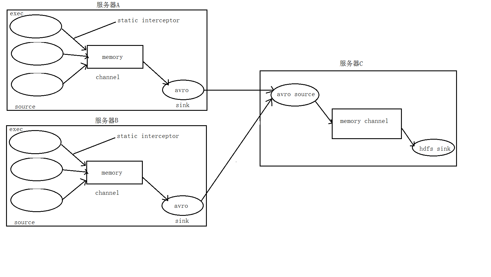
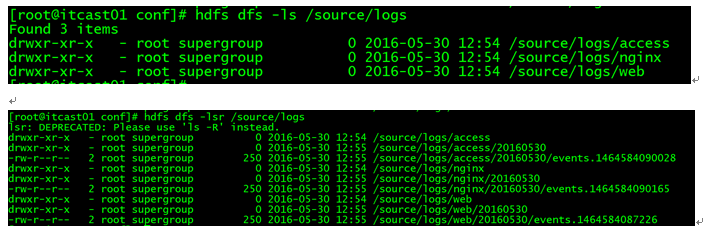

#### flume案例：日志采集和汇总

1. ##### 案例场景

   min1、min2两台日志服务机器实时生产日志主要类型为access.log、nginx.log、web.log 

   现在要求：

   把min1、min2 机器中的access.log、nginx.log、web.log 采集汇总到min3机器上然后统一收集到hdfs中。

   但是在hdfs中要求的目录为：

   /source/logs/access/20160101/**

   /source/logs/nginx/20160101/**

   /source/logs/web/20160101/**

2. ##### 场景分析

   ##### 

3. ##### 数据流处理分析

   ##### 

4. ##### 配置文件

   服务器A对应的IP为192.168.200.102

   服务器B对应的IP为192.168.200.103

   服务器C对应的IP为192.168.200.101

   ```
   ①　在服务器A和服务器B上的$FLUME_HOME/conf 创建配置文件	exec_source_avro_sink.conf  文件内容为

   # Name the components on this agent
   a1.sources = r1 r2 r3
   a1.sinks = k1
   a1.channels = c1

   # Describe/configure the source
   a1.sources.r1.type = exec
   a1.sources.r1.command = tail -F /root/data/access.log
   a1.sources.r1.interceptors = i1
   a1.sources.r1.interceptors.i1.type = static
   ##  static拦截器的功能就是往采集到的数据的header中插入自己定## 义的key-value对
   a1.sources.r1.interceptors.i1.key = type
   a1.sources.r1.interceptors.i1.value = access

   a1.sources.r2.type = exec
   a1.sources.r2.command = tail -F /root/data/nginx.log
   a1.sources.r2.interceptors = i2
   a1.sources.r2.interceptors.i2.type = static
   a1.sources.r2.interceptors.i2.key = type
   a1.sources.r2.interceptors.i2.value = nginx

   a1.sources.r3.type = exec
   a1.sources.r3.command = tail -F /root/data/web.log
   a1.sources.r3.interceptors = i3
   a1.sources.r3.interceptors.i3.type = static
   a1.sources.r3.interceptors.i3.key = type
   a1.sources.r3.interceptors.i3.value = web

   # Describe the sink
   a1.sinks.k1.type = avro
   a1.sinks.k1.hostname = hdp03
   a1.sinks.k1.port = 41414

   # Use a channel which buffers events in memory
   a1.channels.c1.type = memory
   a1.channels.c1.capacity = 20000
   a1.channels.c1.transactionCapacity = 10000

   # Bind the source and sink to the channel
   a1.sources.r1.channels = c1
   a1.sources.r2.channels = c1
   a1.sources.r3.channels = c1
   a1.sinks.k1.channel = c1

   ```

   ```
   ②　在服务器C上的$FLUME_HOME/conf 创建配置文件	avro_source_hdfs_sink.conf  文件内容为

   #定义agent名， source、channel、sink的名称
   a1.sources = r1
   a1.sinks = k1
   a1.channels = c1


   #定义source
   a1.sources.r1.type = avro
   a1.sources.r1.bind = hdp03
   a1.sources.r1.port =41414

   #添加时间拦截器
   a1.sources.r1.interceptors = i1
   a1.sources.r1.interceptors.i1.type = org.apache.flume.interceptor.TimestampInterceptor$Builder


   #定义channels
   a1.channels.c1.type = memory
   a1.channels.c1.capacity = 20000
   a1.channels.c1.transactionCapacity = 10000

   #定义sink
   a1.sinks.k1.type = hdfs
   a1.sinks.k1.hdfs.path=hdfs://hdp01:9000/flume/logs/%{type}/%Y%m%d
   a1.sinks.k1.hdfs.filePrefix =events
   a1.sinks.k1.hdfs.fileType = DataStream
   a1.sinks.k1.hdfs.writeFormat = Text
   #时间类型
   a1.sinks.k1.hdfs.useLocalTimeStamp = true
   #生成的文件不按条数生成
   a1.sinks.k1.hdfs.rollCount = 0
   #生成的文件按时间生成
   a1.sinks.k1.hdfs.rollInterval = 30
   #生成的文件按大小生成
   a1.sinks.k1.hdfs.rollSize  = 10485760
   #批量写入hdfs的个数
   a1.sinks.k1.hdfs.batchSize = 10000
   flume操作hdfs的线程数（包括新建，写入等）
   a1.sinks.k1.hdfs.threadsPoolSize=10
   #操作hdfs超时时间
   a1.sinks.k1.hdfs.callTimeout=30000

   #组装source、channel、sink
   a1.sources.r1.channels = c1
   a1.sinks.k1.channel = c1

   ```

   ```
   ③　配置完成之后，在服务器A和B上的/root/data有数据文件access.log、nginx.log、web.log。先启动服务器C上的flume，启动命令
   在flume安装目录下执行 ：
   bin/flume-ng agent -c conf -f conf/avro_source_hdfs_sink.conf -name a1 -Dflume.root.logger=DEBUG,console	

   然后在启动服务器上的A和B，启动命令
   在flume安装目录下执行 ：
   bin/flume-ng agent -c conf -f conf/exec_source_avro_sink.conf -name a1 -Dflume.root.logger=DEBUG,console	

   ```

5. ##### 查看数据传输结果

   ##### 