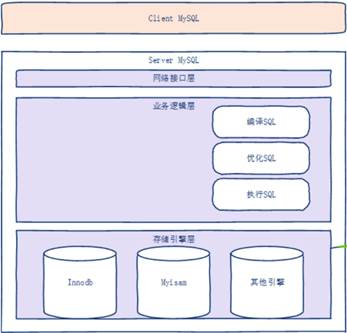

 

## 1. 什么是hbase

### 1.1数据库产生的需求背景

文件系统和数据库都是管理你的数据的。例如有这样一个需求场景，北京市公安局管理北京地区的人口信息，使用windows系统的“ person . txt”文件保存管理人口信息，大致信息如下：

1，张三，男，19，海淀区回龙观北店嘉园小区18-9-901 

2，李四，男，15，朝阳区soho小区1-1-101 

3，王五，女，19，西城区西单十八层小区18-18-1801 

4，赵六，男，49，海淀区ooooooo小区4-4-404 

5，张四，女，38，海淀区回龙观北店嘉园小区3-3-301 

6，张三，男，20，门头沟区xxxxxxxxxx区18-9-901 

7，黄三，男，89，海淀区回龙观北店嘉园小区18-9-901 

.................................

 

用txt文件管理北京人口信息可以不可以？可以，但是很麻烦，主要问题有：

1.        人口信息2000多万，这个txt文件就非常大吧，查看起来非常不方便。

2.        要根据某人的住址查询某人的姓名，怎么办？使用人为的打开txt文件，然后从上到下比对“住址”信息，比对上后，就能查出该人的姓名了吧。但是这个表有上千万的数据，人工查找，会非常非常的费劲。

3.        跟2同样的问题是，要修改/删除/增加人口信息，要人工的对person.txt文件做修改。也会非常非常的费劲吧。

 

由于使用txt文件管理人口信息的上述问题。就有了数据库产品如mysql、oracle、DB2

Mysql 是基于windows或linux系统的文件系统的数据库。因此最终mysql的数据也是以文件的形式保存在windows或linux系统上的。那mysql相关的文件是什么样呢？

 

Mysql的保存数据的文件类型

.frm 保存  你定义的表的 字段名  类型  等（name string ，age int）mysql的元数据。

.myd 最终保存的数据信息，如上面的“人口信息”

 

 

较完整的mysql软件层次结构

​     

 

### 1.2 mysql与hbase对比

前面我们已经说过了，mysql是基于linux或windows文件系统的数据库，而hbase是基于HDFS（跟mr无关）文件系统的数据库。因此就知道了hbase也是一种数据库。

从使用者的角度来看两者的直观的区别：

1.        存储数据量：由于两者基于不同的文件系统，因此推导出mysql存放数据的量不能太大而hbase可以存放数十亿条数据，甚至更大。

2.        MySQL的列在创建好表后，就固定了，在插入数据时只能往固定的列中插入数据；而hbase的列在插入数据时，可以动态增加。

[Mysql ]()表的问题：

 

Hbase 表的特点：

 

并不是有了hbase，mysql就没用了啊，还是那句话“没有最好最坏，只有最适合”。Msql适合传统的银行系统的数据，而hbase适合“qq、微信”等社交软件中产生的数据。

 

## 2.hbase的安装配置

### 2.1 单机版安装配置

单机版不需要运行在hadoop上，是模拟hbase运行效果，完全是用于测试。

 

1.机器规划：使用“CentOS6.7_64-bit-min1”虚拟机作为hbase运行的硬件环境。

2.上传hbase-1.1.2-bin.tar.gz到/home/hadoop/develop_env/

 

3.解压hbase-1.1.2-bin.tar.gz到当前路径

tar -zxvf hbase-1.1.2-bin.tar.gz

 

4.配置JAVA_HOME

vi   $HBASE_HOME/conf/hbase-env.sh   #添加如下信息

5.配置被hbase-site.xml文件

vi $HBASE_HOME/conf/hbase-site.xml  #添加如下信息

添加如下配置项：

<property>

 <name>hbase.rootdir</name>

  <value>[file:///home/hadoop/develop_env/hbase](file:///home/bigdata/hbase)-1.1.2/data</value>

</property>

<property>

 <name>hbase.zookeeper.property.dataDir</name>

  <value>/home/hadoop/develop_env/hbase-1.1.2/zookeeper</value>

</property>

 

(1)      hbase.rootdir指的是HBase用来存放数据的目录，这个目录**不需要自己创建**，HBase会帮助我们进行配置。如果你自己创建了这个目录，HBase会尝试将其做一个迁移，这可能不是你想要的结果。

(2)      hbase.zookeeper.property.dataDir是用来存放HBase自己管理的zookeeper的属性数据信息的目录,   **hbase****用到了zk****，而hbase****就内置了一个zk****，而单机版hbase****使用自己内置的zk****就可以了**。

 

至此，Hbase的单机安装配置就完毕了。

 

6.测试hbase是否配置成功

(1)启动hbase服务 (由于是单机本不需要启动hdfs)

. / bin / start-hbase.sh

(2) 通过web浏览hbase管理页面

默认地址为：[http://192.168.18.64:16010/](http://master:16010/)

注意：0.9x极以前的版本中，webUI地址的默认端口为60010。

​    (3)使用jps 显示如下进程信息

 

 

7.hbaseh常用shell命令

* *

* *

在min2的/HBASE_HOME/bin/目录下执行

./ bin /[hbase shell]()[[y1\]](#_msocom_1)    #启动hbase的shell (也是hbase的客户端)

** **

**在HBase shell****中使用help****命令**

hbase(main):001:0>help

** **

**查看list****命令的帮助**

help   ‘list’

Ø **创建表（需要创建表名和列族）**

hbase(main):001:0> create 'test', 'cf'

 

Ø **列出表信息**

hbase(main):001:0>list 'test'

 

Ø **往表中添加数据**

hbase(main):001:0>put 'test', 'row1', 'cf:a', 'value1'   

hbase(main):002:0>put 'test', 'row2', 'cf:b', 'value2'

hbase(main):003:0>put 'test', 'row3', 'cf:c', 'value3'

 

Ø **扫描全表数据**

hbase(main):001:0> scan 'test'

 

Ø **获取某行数据**

hbase(main):003:0>get 'test', 'row1'

 

Ø **禁用表（在删除表之前要现将其禁用）**

hbase(main):001:0>disable 'test'

 

Ø **启用表**

hbase(main):001:0>enable 'test'

 

Ø **删除表**

hbase(main):001:0>drop 'test'

Ø 退出hbase shell

hbase(main):001:0>quit

 

### 2.2 分布式安装配置

1集群规划（在前面课程的那七台HA机器中配置我们的hbase集群）

 ** HA****集群规划**：

| 主机(hostname) | 安装软件                       | 运行进程（只启动hdfs服务即可）          |
| -------------- | ------------------------------ | --------------------------------------- |
| ha1            | hadoop-2.7.1                   | NameNode、DFSZKFailoverController(zkfc) |
| ha2            | hadoop-2.7.1                   | NameNode、DFSZKFailoverController(zkfc) |
| ha3            | hadoop-2.7.1                   |                                         |
| ha4            | hadoop-2.7.1                   |                                         |
| ha5            | hadoop-2.7.1 ，zookeeper-3.4.7 | DataNode、JournalNode、QuorumPeerMain   |
| ha6            | hadoop-2.7.1 ，zookeeper-3.4.7 | DataNode、JournalNode、QuorumPeerMain   |
| ha7            | hadoop-2.7.1 ，zookeeper-3.4.7 | DataNode、JournalNode、QuorumPeerMain   |

** **

**在****HA****的基础上，在规划****Hbase****的环境：******

| 主机(hostname) | 安装软件    | 运行进程      |
| -------------- | ----------- | ------------- |
| ha3            | hbase-1.1.2 | HMaster       |
| ha4            | hbase-1.1.2 | HMaster       |
| ha5            | hbase-1.1.2 | HRegionServer |
| ha6            | hbase-1.1.2 | HRegionServer |
| ha7            | hbase-1.1.2 | HRegionServer |

 

2.安装步骤

（1）.将hbase-1.1.2-bin.tar.gz上传到ha3的/home/hadoop/app/

 

（2）.解压

tar   -zxvf   hbase-1.1.2-bin.tar.gz 

 

（3）.要把hadoop的hdfs-site.xml和core-site.xml 拷贝到HBASE_HOME/conf下

 

cp /home/hadoop/develop_env/hadoop-2.7.1/etc/hadoop/hdfs-site.xml \

/home/hadoop/develop_env/hbase-1.1.2/conf/

 

cp /home/hadoop/develop_env/hadoop-2.7.1/etc/hadoop/core-site.xml \

/home/hadoop/develop_env/hbase-1.1.2/conf/ 

 

（4）.修改hbase_home/conf/hbase-env.sh如下两行信息

 

export JAVA_HOME=/home/hadoop/app/jdk1.7.0_65

//告诉hbase使用外部的zk

export HBASE_MANAGES_ZK=false

 

（5）.修改hbase_home/conf/hbase-site.xml

<configuration>

<!-- 指定hbase在HDFS上存储的路径 -->

<property>

<name>hbase.rootdir</name>

<value>hdfs://ns1/hbase</value>

</property>

<!-- 指定hbase是分布式的 -->

<property>

<name>hbase.cluster.distributed</name>

<value>true</value>

</property>

<!-- 指定zk的地址，多个用“,”分割 -->

<property>

<name>hbase.zookeeper.quorum</name>

<value>ha5:2181,ha6:2181,ha7:2181</value>

</property>

</configuration>

 

（6）.修改hbase_home/conf/regionservers

ha5

ha6

Ha7

 

（7）.从ha3 拷贝 hbase到ha4，ha5，ha6，ha7

scp -r /home/hadoop/develop_env/hbase-1.1.2/  ha4:/home/hadoop/develop_env/

scp -r /home/hadoop/develop_env/hbase-1.1.2/  ha5:/home/hadoop/develop_env/

scp -r /home/hadoop/develop_env/hbase-1.1.2/  ha6:/home/hadoop/develop_env/

scp -r /home/hadoop/develop_env/hbase-1.1.2/  ha7:/home/hadoop/develop_env/

 

 

 

（8）.将配置好的HBase拷贝到每一个节点并同步时间。

 

（9）.启动所有的hbase

分别启动ha5,ha6,ha7中的zk

./zkServer.sh start

 

启动hhdfs集群,不用启动yard

start-dfs.sh

 

启动hbase，在ha3主节点上运行：

start-hbase.sh

注意：[从]()ha3到ha5，ha6，ha7也要免密登录[[y2\]](#_msocom_2) 

 

 

（10）.通过浏览器访问hbase管理页面

[http://192.168.18.173:16010](http://192.168.18.173:60010)

 

（11）.为保证集群的可靠性，要启动多个HMaster也就是在ha4上再启动一个hbase

hbase-daemon.sh start master

 

（12）启动hbase的命令行工具

在ha3的/HBASE_HOME/bin/目录下执行

./hbase shell

进入命令行界面

执行help查看所有hbase所有命令

 

### 2.3 伪分布式安装配置

伪分布式方式安装时，HBase的每个守护程序（HMaster，HRegionServer，和Zookeeper）都将作为一个单独的进程运行在同一台机器上，并且会将数据的存储方式由Linux本地文件系统更换为HDFS分布式文件系统，这意味着需要有一个可用的hadoop集群。

 

1.机器规划：使用“CentOS6.7_64-bit-min2”虚拟机作为hbase运行的硬件环境。

2.上传hbase-1.1.2-bin.tar.gz到/home/hadoop/develop_env/

 

3.解压hbase-1.1.2-bin.tar.gz到当前路径

tar -zxvf hbase-1.1.2-bin.tar.gz

 

4.配置JAVA_HOME

vi   $HBASE_HOME/conf/hbase-env.sh   #添加如下信息

5.配置被hbase-site.xml文件

vi $HBASE_HOME/conf/hbase-site.xml  #添加如下信息

添加如下配置项：

**<!--****配置HBase****使用分布式方式-->**

<property>

   <name>hbase.cluster.distributed</name>

   <value>true</value>

</property>

**<!--hbase****中的数据在HDFS****上的位置-->**

**<!—**

**注意，这里添加的是HDFS****的fs.defaultFS ****配置项的值，这个值跟HDFS****是否开启HA****有关系**

**这个目录不需要自己创建，HBase****会帮助我们进行配置。如果你自己创建了这个目录，HBase****会尝试将其做一个迁移，这可能不是你想要的结果-->**

<property>

 <name>hbase.rootdir</name>

  <value>hdfs://min1:9000/hbase</value>

</property>

<property>

 <name>hbase.zookeeper.property.dataDir</name>

  <value>/home/hadoop/develop_env/hbase-1.1.2/zookeeper</value>

</property>

 

6.启动所有的hbase

启动hdfs集群,不用启动yard

start-dfs.sh

 

启动hbase

start-hbase.sh

7.使用jps命令查看

**HquorumPeer****进程证明Hbase****内部的Zookeeper****已启动**

**显示出上图的三个进程说明hbase****启动成了。**

 

## 3.Hbase的基本概念

### 逻辑概念

 

 

 

如下图所示，是一个HBase的典型表，HBase中通过多个条件（经常称之为坐标）来定位表中的数据：

#### 表

HBase表由多行组成。

#### 行

一行在HBase由行键和一个或多个列的值组成。如下图所示：

行按字母顺序排序的行键存储，行健类似关系型数据库中的ID列。如下图所示：

#### Row Key

与nosql数据库们一样,rowkey是用来检索记录的主键。访问HBASE table中的行，只有三种方式：

1.通过单个rowkey访问

2.通过rowkey的range（正则）

3.全表扫描

Row key行键 可以是任意字符串(最大长度 是 64KB，实际应用中长度一般为 10-100bytes)，在HBASE内部，rowkey保存为字节数组。存储时，数据按照Row key的字典序(byte order)排序存储。设计key时，要充分排序存储这个特性，将经常一起读取的行存储放到一起。(位置相关性)

 

*保存为“字节数组”的意思：没有**int**类型、**char**类型等数据类型之分，都是**ascii**码***

*字典序的意思：**2 **和**10 **排序时，**10**排在**2**的前面。** **因为数据都保存为** **字节数组** **，因此也就没有**  **数据类型了（如果有数据类型的话，**2**应排在**10**之前）** *

 

#### 列

列是表中的最基本元素，HBase的列包含一个列族和一个列限定符，列属于一个列族，列族属于一个行。列中的内容不需要指定类型，这也是与关系型数据不同的地方，也是HBase被称之为无类型的数据库的原因。HBase的列与关系型数据库不同，在于其含有版本的概念，一个列的数据可以有多个历史版本，体现形式就是时间戳。

#### 列族

在关系型数据库中没有列族的概念，在HBase中，列族是一行中一个或多个列的集合，就是一行数据的一部分。列族需要在表创建时就定义好，并且不能修改的太频繁，数量也不能太多，在以前的HBase实现中有少量已知的缺陷，导致列族的数量最多只能使用几十个。列族中的列的数量是没有限制的。

#### 列限定符

如图所示，列族中可以包含多个列，一个表中的某个列的定位方式就成为了meta:size 这种方式。我们就称之为列限定符，说白了，列限定符即指一个列族中的某个列。

#### 单元格

一个单元格是行、列族和列限定符的结合，也就是说，通过这三个值（也称之为坐标）来唯一确定一个单元格。其中包含值和创建这个值的时间（即时间戳）。单元格中的值与关系型数据库不同的是，其如果没有值的话，就为空，什么也不写，也不占用底层物理存储。关系型数据中则需要存储null。

#### 时间戳

时间戳就是写入某个单元格中的数据时候的具体时间（从1970年1月1日开始到当前系统时间的一个毫秒值），用来表示一个单元格中的数据的新旧。

 

 

### 物理概念

上述的逻辑概念最终还是要体现在物理机器上才有意义。那一个大“表”如何存储在机器中的呢？

1.将一个大表按“行”划分不同的部分，每一个部分叫一个Region也就是一个Region由若干条记录组成。而一个Region根据“列族”，又可以划分成不同部分，这每一部分叫store。

2.将每一个Region存放到hbase集群中的某台机器上，这个机器叫RegionServer

 

3.每个Region最终还是存放到一个文件系统中，这个文件系统就是hdfs，这点跟mysql类似（mysql的表最终还是以文件的形式存在）。这个存在hdfs的文件叫做HFile

 

4.hbase既然是集群那么必然就有机器是管理者，这样的机器在hbase中叫HMaster，其他机器就是RegionServer

 

那上图中各个角色的主机有什么作用呢？

hmaster：相当于hbase中老大

管理多个hregionserver

存储namespace（相当于mysql的database）、 所有table

它决定hregion的创建

决定hregion的split(正常变大)、和数据重新分配(split、 故障转移)

hregionserver:hbase核心服务

1、负责处理来自于client的的i/o请求

2、管理自己的多个hregion

3、负责数据存取、hreion的拆分

zookeeper：   rowkey 001-003  ， ip地址指向resionServer1

保证有且仅有一个active的hmaster(监控hmaster)

存储整个hbase的元数据(table名、列簇名、列名)

存储hregion的寻址的数据

 

#### Hbase物理模型:

每个column family存储在HDFS上的一个单独文件中，空值不会被保存。
Key 和 Version number在每个 column family中均有一份；
HBase 为每个值维护了多级索引，即：<key, column family, column name, timestamp>

物理存储:
1、Table中所有行都按照row key的字典序排列；
2、Table在行的方向上分割为多个Region；
3、Region按大小分割的，每个表开始只有一个region，随着数据增多，region不断增大，当增大到一个阀值的时候，region就会等分为两个新的region，之后会有越来越多的region；
4、Region是Hbase中分布式存储和负载均衡的最小单元，不同Region分布到不同RegionServer上。

5、Region虽然是分布式存储的最小单元，但并不是存储的最小单元。Region由一个或者多个Store组成，每个store保存一个columns family；每个Strore又由一个memStore和0至多个StoreFile组成，StoreFile包含HFile；memStore存储在内存中，StoreFile存储在HDFS上

 

####  Hbase详细结构

   

 

## 4.hbase shell常用命令

下面我们看看HBase Shell的一些基本操作命令，我列出了几个常用的HBase Shell命令，如下：

| 名称                       | 命令表达式                                                   |
| -------------------------- | ------------------------------------------------------------ |
| 创建表                     | create '表名称', '列名称1','列名称2','列名称N'               |
| 添加记录                   | put '表名称', '行名称', '列名称:', '值'                      |
| 查看记录                   | get '表名称', '行名称'                                       |
| 查看表中的记录总数         | count  '表名称'                                              |
| 删除记录                   | delete  '表名' ,'行名称' , '列名称'                          |
| 删除一张表                 | 先要屏蔽该表，才能对该表进行删除，第一步 disable '表名称' 第二步 drop '表名称' |
| 查看所有记录               | scan "表名称"                                                |
| 查看某个表某个列中所有数据 | scan "表名称" , ['列名称:']                                  |
| 更新记录                   | 就是重写一遍进行覆盖                                         |

 

### 4.1、一般操作

1.查询服务器状态

2.查询hbase版本

### 

### 4.2、DDL操作

1.创建一个表（包含三个列族）

create'member','member_id','address','info' 

​     

2.获得表的描述

list

​    

describe 'member'

3.删除一个列族，alter，disable，enable

我们之前建了3个列族，但是发现member_id这个列族是多余的，因为他就是主键，所以我们要将其删除。（关键字大小写敏感）

disable 'member'

alter'member',NAME=>'member_id',METHOD=>'delete'

describe 'member'

该列族已经删除，我们继续将表enable

enable 'member'  

4.drop一个表

disable 'temp_table'

drop 'temp_table'

6.查询表是否存在

exists 'member'

7.判断表是否enable

is_enabled 'member'

8.判断表是否disable

is_disabled 'member'

 

9.显示所有namespace（相当于mysql的database）

list_namespace

 

10.创建namespace

create_namespace‘ns1’

 

11.  在一个namespace下创建一个表

create  ‘ns1:table1’ , ’cf1’   #在ns1下创建一个名为table1的表，有一个cf1的列簇

 

12.  查看namespace下的所有表  

list_namespace_tables   ‘ns1’

 

13.  查看namespace的描述

describe_namespace  ‘ns1’

 

14.  删除namespace

drop_namespace  ‘ns1’  #ns1下有表的话不能删除

 

### 4.3、DML操作

1.插入几条记录

put 'member','xiaoming','info:age','24'

put 'member','xiaoming','info:birthday','1987-06-17'

put 'member','xiaoming','info:company','alibaba'

put 'member','xiaoming','address:contry','china'

put 'member','xiaoming','address:province','zhejiang'

put 'member','xiaoming','address:city','hangzhou'

 

put 'member','xiaofeng','info:birthday','1987-4-17'

put 'member','xiaofeng','info:favorite','movie' 

put 'member','xiaofeng','info:company','alibaba'

put 'member','xiaofeng','address:contry','china'

put 'member','xiaofeng','address:province','guangdong'

put 'member','xiaofeng','address:city','jieyang'

put 'member','xiaofeng','address:town','xianqiao'

 

2.获取一条数据

获取一个id的所有数据

get 'member','xiaofeng'

获取一个id，一个列族的所有数据

get 'member','xiaoming','info'

获取一个id，一个列族中一个列的所有数据

get'member','xiaoming','info:age' 

3.更新一条记录

将xiaoming的年龄改成99

put'member','xiaoming','info:age' ,'99'

get'member','xiaoming','info:age' 

4.通过timestamp来获取两个版本的数据

get'member','xiaoming',{COLUMN=>'info:age',TIMESTAMP=>1321586238965}

get 'member','xiaoming',{COLUMN=>'info:age',TIMESTAMP=>1321586571843}

 

Scan ‘member’ , ‘{RAW=>true , VERSIONS=>3}  //显示member表的所有列簇3个版本的信息

 

5.删除id为xiaoming的值的‘info:age’字段

delete'member','xiaoming','info:age'

6.删除整行

deleteall'member','xiaofeng'

7.查询表中有多少行：

count 'member'                                     

8.给xiaofeng这个id增加'info:age'字段

incr'member','xiaofeng','info:age'                   

get'member','xiaofeng','info:age' 

9.将整张表清空：

truncate 'member'

可以看出，hbase是先将掉disable掉，然后drop掉后重建表来实现清空的功能的。

 

得到所有行info:birthday列中的数据

scan 'member' ,{COLUMNS => 'info:birthday'}

 

 

 

### 4.4、scan操作

查询user表中的所有信息

scan 'user'

 

查询user表中列族为info的信息

scan 'user',{COLUMNS => 'info'}

\#等价于这个mysql语句Select name  from user;

 

 

查询user表中列族为info和data的信息

scan 'user',{COLUMNS => ['info', 'data']}

\#等价于这个mysql语句Select  name , age  from user;

 

scan 'user',{COLUMNS => ['info:name', 'data:pic']}

 

 

查询user表中列族为info、列标示符为name的信息

scan 'user',{COLUMNS => 'info:name'}

 

查询user表中列族为info、列标示符为name的信息,并且版本最新的5个

scan 'user',{COLUMNS => 'info:name', VERSIONS => 5}

 

查询user表中列族为info和data且列标示符中含有a字符的信息

scan 'user',{COLUMNS => ['info', 'data'], FILTER =>"(QualifierFilter(=,'substring:a'))"}

 

 rk0003

查询user表中列族为info，rk范围是[rk0001, )的数据

scan 'people',{COLUMNS => 'info', STARTROW => 'rk0001', ENDROW => 'rk0003'}

 

查询user表中row key以rk字符开头的

scan'user',{FILTER=>"PrefixFilter('rk')"}

 

查询user表中指定范围的数据

scan 'user',{TIMERANGE => [1392368783980, 1392380169184]}

 

 

 

 

 

 

 

 

 

 

 

 

 

 

 

 

 

 

 

 

 

 

 

 

 

从使用者的角度来说，mysql和hbase又两种不同类型的数据库，前者是“关系型数据库”；后者是“非关系型数据库”（non-relational）

 

关系型数据库的概念

Nosql的概念

 

 

 

 

 

 

 

 

 

 

 

 

------

*Sql**语句常见分类：DDL **数据定义语言、DML**数据操作语言、*

* *

*注意： Hbase**的shell**中要想删除输入的字符，需要ctrl + Backspace *

*或者  **使用“左右键”移动要删除字符的位置，然后按Delete**键删除当    **前字符*

*清除屏幕中字符    ctrl + l*

 

（1）在/home/hadoop目录下执行下面命令，生成密钥对

​    ssh-keygen -t rsa （四个回车）

​    执行完此命令后，在/home/hadoop/.ssh目录生成id_rsa和id_rsa.pub前者是私钥，后者是公钥

（2）将公钥拷贝到要免登陆的机器上

​     在/home/hadoop/.ssh目录执行如下命令

​      ssh-copy-id  ha5

 