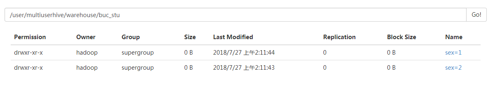
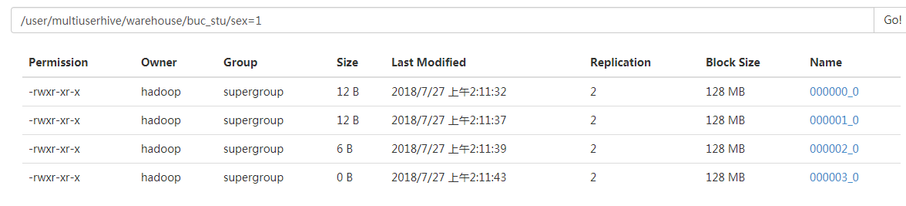
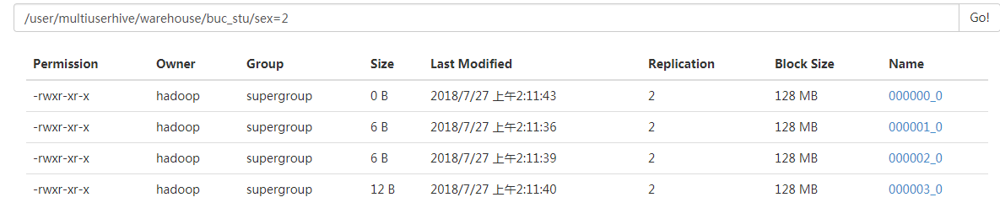

#### 						Hive分桶

先介绍一下Hive桶。 
桶是比表或分区更为细粒度的数据范围划分。针对某一列进行桶的组织，对列值哈希，然后除以桶的个数求余，决定将该条记录存放到哪个桶中。 
好处： 
1、获得更高的查询处理效率。 
2、使抽样更高效。

```
#首先创建一个分桶表
create table if not exists buc2(
uid int,
uname string,
age int
)
clustered by (uid) into 4 buckets
row format delimited fields terminated by ','
;
#加载数据到分桶表：(load方式加载数据不能体现分桶)
bucket1.txt内数据
1,p1,12
2,p2,11
3,p3,33
4,p4,22
5,p5,23
6,p6,23
7,p7,90
8,p8,12
9,p9,34

load data local inpath '/home/hadoop/testData/bucket1.txt'
into table buc2;
#设置强制分桶属性
set hive.enforce.bucketing;//查看当前状态
set hive.enforce.bucketing=true;//原始为false
set mapreduce.job.reduces=4;//如果设置了reduces的个数，在执行分桶之前，最好是将reduces的数量设置成分桶的数量。
#创建临时表
create table if not exists buc_temp(
uid int,
uname string,
age int
)
row format delimited fields terminated by ','
;
#加载数据
load data local inpath '/home/hadoop/testData/bucket1.txt'
into table buc_temp;
#使用insert into的方式加载数据到分桶表(这种方式能体现分桶)
insert overwrite table buc2
select uid,uname,age from buc_temp
cluster by(uid)
;
hive> select * from buc2;
OK
4	p4	22
8	p8	12
---------------第一个桶，id:0
1	p1	12
5	p5	23
9	p9	34
---------------第二个桶，id:1
2	p2	11
6	p6	23
---------------第三个桶，id:2
3	p3	33
7	p7	90
---------------第四个桶，id:3

#查询桶的数据
select *from buc2 tablesample(bucket 1 out of 4 on uid);
4	p4	22
8	p8	12

#创建分桶表，指定排序字段已经排序规则（指定的排序是设计者预期的一种排序结果）
create table if not exists buc3(
uid int,
uname string,
age int
)
clustered by (uid)
sorted by (uid desc) into 4 buckets
row format delimited fields terminated by ','
;
#加载数据
insert overwrite table buc3
select uid,uname,age from buc_temp
distribute by (uid) sort by (uid asc);
#查询全部
hive> select * from buc3;
4	p4	22
8	p8	12
1	p1	12
5	p5	23
9	p9	34
2	p2	11
6	p6	23
3	p3	33
7	p7	90
select * from buc3 tablesample(bucket 1 out of 1);
4	p4	22
8	p8	12
1	p1	12
5	p5	23
9	p9	34
2	p2	11
6	p6	23
3	p3	33
7	p7	90
#查询第几桶
select * from buc3 tablesample(bucket 1 out of 4 on uid);//查询的是第一桶的数据
4	p4	22
8	p8	12
select * from buc3 tablesample(bucket 1 out of 2 on uid);//查询的是第1桶和第3桶的数据
4	p4	22
8	p8	12
2	p2	11
6	p6	23
select * from buc3 tablesample(bucket 1 out of 8 on uid);//查询的是第1桶内的第二条数据
8	p8	12

#抽样查询：tablesample(bucket x out of y)
x:代表从第几桶开始查询
y：查询到总桶数，y可以是总桶数的因子或者倍数。x不能大于y
自己总结计算方法：
tablesample(bucket 1 out of 2 on id)
用每行的id%2,若结果等于(1-1)0则表示该行是所求的数据；
tablesample(bucket 2 out of 4 on id)
用每行的id%4,若结果等于(2-1)1则表示该行是所求的数据；
tablesample(bucket 3 out of 8 on id)
用每行的id%8，若结果等于(3-1)2则表示该行是所求的数据

官方计算方法：
tablesample是抽样语句，语法：TABLESAMPLE(BUCKET x OUT OF y) 
y必须是table总bucket数的倍数或者因子。hive根据y的大小，决定抽样的比例。例如，table总共分了64份，当y=32时，抽取(64/32=)2个bucket的数据，当y=128时，抽取(64/128=)1/2个bucket的数据。x表示从哪个bucket开始抽取。例如，table总bucket数为32，tablesample(bucket 3 out of 16)，表示总共抽取（32/16=）2个bucket的数据，分别为第3个bucket和第（3+16=）19个bucket的数据。

#查询id为奇数
select * from buc3 tablesample(bucket 2 out of 2 on uid);//查询id=1,3的桶的数据，也就是第二，四个桶的数据
1	p1	12
5	p5	23
9	p9	34
3	p3	33
7	p7	90
#查询id为奇数以及uname=p9
select * from buc3 tablesample(bucket 2 out of 2 on uid)
where uname='p9';
9	p9	34
#查询前3行数据
select * from buc_temp limit 3;
1	p1	12
2	p2	11
3	p3	33
select * from buc_temp tablesample(3 rows);
1	p1	12
2	p2	11
3	p3	33
select * from buc_temp tablesample(7B);//一个字符为1B,空格也为1B
1	p1	12
select * from buc_temp tablesample(33.33333 percent);//一共有9行数据，所以前3行占所有的33.333333%
1	p1	12
2	p2	11
3	p3	33
#hive的本地执行模式设置（可以提高sql运行速度）
set hive.exec.mode.local.auto=false/true;

##################分桶总结####################
1.定义
clustered by(uid)---指定分桶字段
sorted by (uid desc)---指定数据的排序字段(desc为倒序，asc为升序)
2.导数据
cluster by(uid)---指定gertPartition以哪个字段进行hash，并且排序字段也是这个指定的字段，排序字段默认以顺序排序
distribute by(uid)---指定getPartition以哪个字段进行排序
导入数据时：
insert overwrite table buc3
select uid,uname,age from buc_temp
cluster by(uid);
和
insert overwrite table buc3
select uid,uname,age from buc_temp
distribute by(uid) sort by (uname asc);//这种方式可以分别指定getpartition的字段和sort字段.
这两种结果是一样的.
```


#### 分区下的分桶表

```
按照性别分区（男1女2）在分区中按照uid的奇偶分桶

id,name,sex
1,bb1,1
2,bb2,2
3,bb3,2
4,bb4,1
5,bb5,1
6,bb6,1
7,bb7,2
8,bb8,1
9,bb9,2

创建表：
create table if not exists buc_stu(
uid int,
uname string
)
partitioned by (sex int)
clustered by (uid) into 4 buckets
row format delimited fields terminated by ','
;

创建临时表：
create table stu_temp(
uid int,
uname string,
sex int)
row format delimited fields terminated by ','
;

load data local inpath '/home/hivedata/stu.dat' into table stu_temp;

此时：
set hive.exec.dynamic.partition.mode=nonstrict;
不设置在执行下述代码时会报如下错误：
FAILED: SemanticException [Error 10096]: Dynamic partition strict mode requires at least one static partition column. To turn this off set hive.exec.dynamic.partition.mode=nonstrict

将数据加载到分区分桶表：
insert into table buc_stu partition(sex)
select uid,uname,sex from stu_temp cluster by (uid)
;
```

表buc_stu的分区结构：



分区：sex=1和sex=2内部





下面是sex=1分区中数据：

```
000000_0：
4,bb4
8,bb8
000001_0：
1,bb1
5,bb5
000002_0：
6,bb6
000003_0：
空
```

下面是sex=2分区中数据：

```
000000_0：
空
000001_0：
9,bb9
000002_0：
2,bb2
000003_0：
3,bb3
7,bb7
```


查询性别为女性、学号为奇数的学生：

```
hive> select * from buc_stu tablesample(bucket 2 out of 2 on uid)
    > where sex=2;
OK
9	bb9	2
3	bb3	2
7	bb7	2
```


注意：
1、分区是用的表外字段，分桶用的是表内字段
2、分桶表更多的是用在对数据进行抽样、多表JOIN