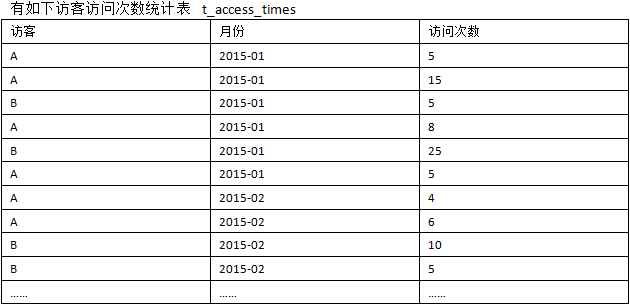
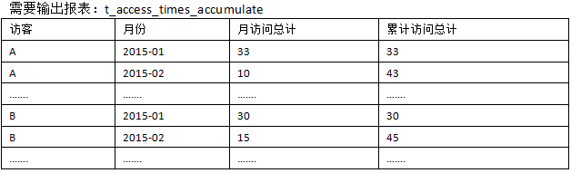

### HQL案例

##### 1.需求



计算结果



##### 2.分析过程

```
第一步：先统计每个用户每个月的总的访问次数
create table if not exists t_access_total
as
select 
username,
month,
sum(salary) as totalcount
from t_access_times
group by username,month
;
结果集：
A	2015-01	33
A	2015-02	10
B	2015-01	30
B	2015-02	15
```

```
第二步：表本身关联，以username做为关联条件
select a.username as aname,
a.month as amonth,
a.totalcount as acount,
b.username as bname,
b.month as bmonth,
b.totalcount as bcount 
from t_access_total a,
t_access_total b
where a.username = b.username
;

结果集：
A       2015-01 33      A       2015-01 33
A       2015-02 10      A       2015-01 33
A       2015-01 33      A       2015-02 10
A       2015-02 10      A       2015-02 10
B       2015-01 30      B       2015-01 30
B       2015-02 15      B       2015-01 30
B       2015-01 30      B       2015-02 15
B       2015-02 15      B       2015-02 15
```

```
第三步：根据上面结果分析出，要得出最后的结果集，
应该以username相等，并且前面的日期小于等于后面日期，
然后前面的数量累加
select a.bname,
a.bmonth,
a.bcount,
sum(a.acount) as totalcount
 from (select a.username as aname,
a.month as amonth,
a.totalcount as acount,
b.username as bname,
b.month as bmonth,
b.totalcount as bcount 
from t_access_total a,
t_access_total b
where a.username = b.username) a
where a.aname=a.bname and
a.amonth <=a.bmonth 
group by a.bname,a.bmonth,a.bcount
;
结果集：
A	2015-01	33	33
A	2015-02	10	43
B	2015-01	30	30
B	2015-02	15	45
```


