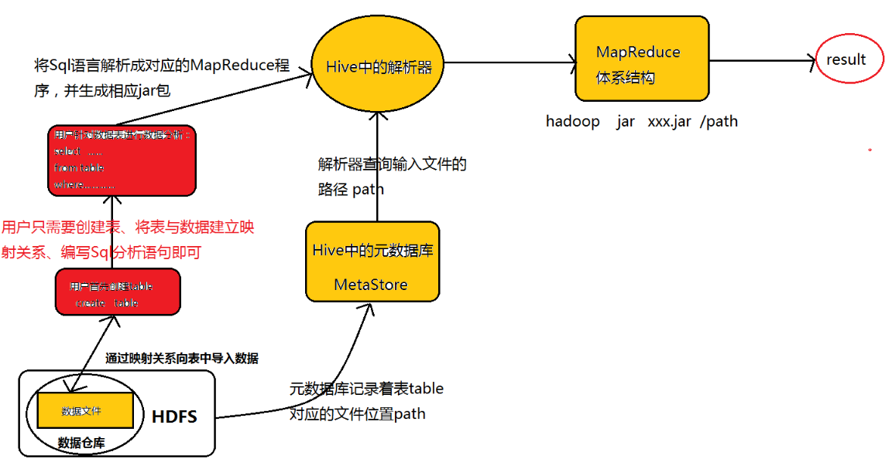

### Hive架构

---摘自网络

[]: https://blog.csdn.net/u010963948/article/details/74348010

------

Hive可以认为是MapReduce的一个封装、包装。Hive的意义就是在业务分析中将用户容易编写、会写的Sql语言转换为复杂难写的MapReduce程序，从而大大降低了Hadoop学习的门槛，让更多的用户可以利用Hadoop进行数据挖掘分析。 
为了让大家容易理解Hive的实质——-“Hive就是一个SQL解析引擎，将SQL语句转化为相应的MapReduce程序”这句话，特地准备了一张图：

从图示可以看出，Hive从某种程度上讲就是很多“SQL—MapReduce”框架的一个封装，可以将用户编写的Sql语言解析成对应的MapReduce程序，最终通过MapReduce运算框架形成运算结果提交给Client。

------

Hive的体系结构：

Hive的体系结构可以分为以下几个部分： 
①用户接口：包括shell命令、Jdbc/Odbc和WebUi，其中最常用的是shell这个客户端方式对Hive进行相应操作 
②Hive解析器(驱动Driver)：Hive解析器的核心功能就是根据用户编写的Sql语法匹配出相应的MapReduce模板，形成对应的MapReduce job进行执行。 
③Hive元数据库(MetaStore)：Hive将表中的元数据信息存储在数据库中，如derby(自带的)、[mysql](http://lib.csdn.net/base/mysql)(实际工作中配置的)，Hive中的元数据信息包括表的名字、表的列和分区、表的属性(是否为外部表等)、表的数据所在的目录等。Hive中的解析器在运行的时候会读取元数据库MetaStore中的相关信息。 
在这里和大家说一下为什么我们在实际业务当中不用Hive自带的数据库derby，而要重新为其配置一个新的数据库Mysql，是因为derby这个数据库具有很大的局限性：derby这个数据库不允许用户打开多个客户端对其进行共享操作，只能有一个客户端打开对其进行操作，即同一时刻只能有一个用户使用它，自然这在工作当中是很不方便的，所以我们要重新为其配置一个数据库。 
④Hadoop：Hive用HDFS进行存储，用MapReduce进行计算——-Hive这个数据仓库的数据存储在HDFS中，业务实际分析计算是利用MapReduce执行的。 
从上面的体系结构中可以看出，在Hadoop的HDFS与MapReduce以及MySql的辅助下，Hive其实就是利用Hive解析器将用户的SQl语句解析成对应的MapReduce程序而已，即Hive仅仅是一个客户端工具，这也是为什么我们在Hive的搭建过程中没有分布与伪分布搭建的原因。(Hive就像是刘邦一样，合理的利用了张良、韩信与萧何的辅助，从而成就了一番大事!) 

------

hive的运行机制：

Hive的运行机制正如图所示：创建完表之后，用户只需要根据业务需求编写Sql语句，而后将由Hive框架将Sql语句解析成对应的MapReduce程序，通过MapReduce计算框架运行job，便得到了我们最终的分析结果。 
在Hive的运行过程中，用户只需要创建表、导入数据、编写Sql分析语句即可，剩下的过程将由Hive框架自动完成，而创建表、导入数据、编写Sql分析语句其实就是数据库的知识了，Hive的运行过程也说明了为什么Hive的存在大大降低了Hadoop的学习门槛以及为什么Hive在Hadoop家族中占有着那么重要的地位。 

------

Hive与Hbase的区别：

其实从严格意义上讲，Hive与Hbase就不应该谈区别，谈区别的原因无非就是Hive与Hbase本身都涉及到了表的创建、向表中插入数据等等。所以我们希望找到Hive与Hbase的区别，但是为什么两者谈不上区别呢，原因如下： 
1、根据上文分析，Hive从某种程度上讲就是很多“SQL—MapReduce”框架的一个封装，即Hive就是MapReduce的一个封装，Hive的意义就是在业务分析中将用户容易编写、会写的Sql语言转换为复杂难写的MapReduce程序。 
2、Hbase可以认为是hdfs的一个包装。他的本质是数据存储，是个NoSql数据库；hbase部署于hdfs之上，并且克服了hdfs在随机读写方面的缺点。 
因此若要问Hive与Hbase之前的区别，就相当于问HDFS与MapReduce之间的区别，而HDFS与MapReduce两者之间谈区别意义并不大。 
但是当我们非要谈Hbase与Hive的区别时，可以从以下几个方面进行讨论： 
Hive和Hbase是两种基于Hadoop的不同技术–Hive是一种类SQL的引擎，并且运行MapReduce任务，Hbase是一种在Hadoop之上的NoSQL 的Key/vale数据库。当然，这两种工具是可以同时使用的。就像用Google来搜索，用FaceBook进行社交一样，Hive可以用来进行统计查询，HBase可以用来进行实时查询，数据也可以从Hive写到Hbase，设置再从Hbase写回Hive。 
Hive适合用来对一段时间内的数据进行分析查询，例如，用来计算趋势或者网站的日志。Hive不应该用来进行实时的查询。因为它需要很长时间才可以返回结果。 
Hbase非常适合用来进行大数据的实时查询。Facebook用Hive进行消息和实时的分析。它也可以用来统计Facebook的连接数。 