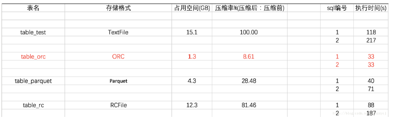
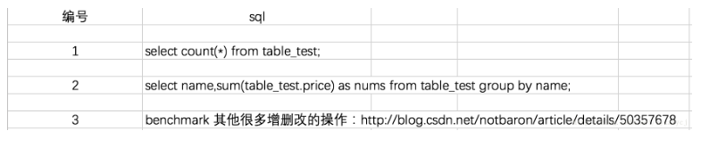
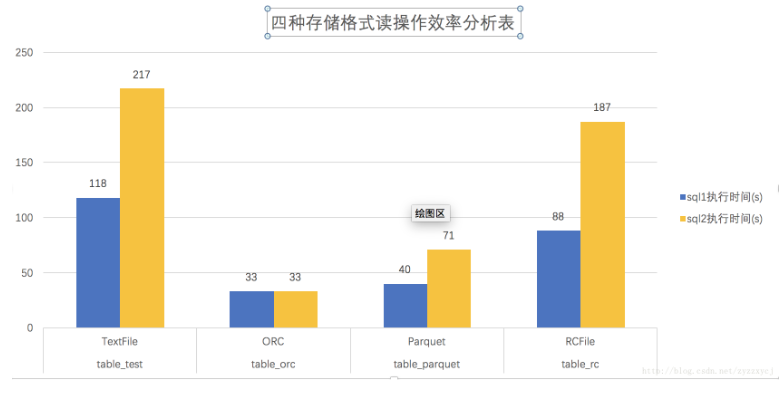
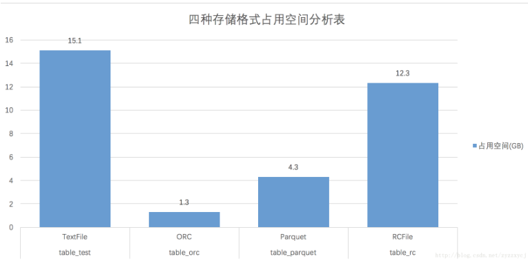

### Hive的四种存储格式及其对比

---摘自网络

[]: https://blog.csdn.net/zyzzxycj/article/details/79267635

------

一、四种存储格式介绍

1、TextFile

 TextFile文件不支持块压缩，默认格式，数据不做压缩，磁盘开销大，数据解析开销大。这边不做深入介绍。

2、RCFile

 Record Columnar的缩写。是Hadoop中第一个列文件格式。能够很好的压缩和快速的查询性能，但是不支持模式演进。通常

写操作比较慢，比非列形式的文件格式需要更多的内存空间和计算量。

 RCFile是一种行列存储相结合的存储方式。首先，其将数据按行分块，保证同一个record在一个块上，避免读一个记录需要读

取多个block。其次，块数据列式存储，有利于数据压缩和快速的列存取。

3、ORCFile

 存储方式：数据按行分块 每块按照列存储 ，压缩快 快速列存取，效率比rcfile高,是rcfile的改良版本，相比RC能够更好的压

缩，能够更快的查询，但还是不支持模式演进。

4、Parquet

 Parquet能够很好的压缩，有很好的查询性能，支持有限的模式演进。但是写速度通常比较慢。这中文件格式主要是用在Cloudera Impala上面的。

二、四种存储格式分析

1、分析结果数据表

sql编号：

2、读操作效率分析结果

3、存储效率分析结果

------

