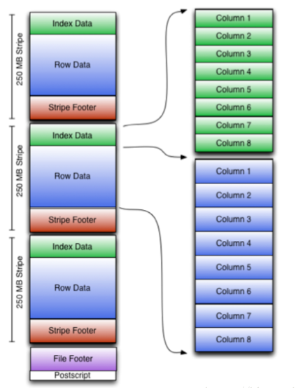

### Hive存储格式ORC

---摘自网络

[]: https://blog.csdn.net/qq_37142346/article/details/79873376

------

ORC结构图：



在ORC格式存储的表中，它会将记录横向切分为多个stripes，每一个stripe以列为单位进行存储，所有列会保存在一个文件中，每个stripe的默认大小为250MB，相对于RCFile每个4MB的stripe而言，更大的stripe使ORC的数据读取更加高效。 

ORC和Parquet存储格式要比Text格式读写数据的性能要好，在企业中一般大多情况下会采用这两种存储格式。 
这时，我们可能要问为什么这两种存储格式的性能会好？什么时候用到这两种存储格式呢？这里简单说明一下，在很多时候，我们查询语句都会用到where语句对某一列进行筛选，如果采用行式存储格式（TEXT File），我们要在一行中找出对应的列，然后再进行筛选，而使用ORC和Parquet列式存储格式，会直接定位在某一列进行筛选，因此性能会提高很多。

ORC存储格式和Parquet存储格式对文件的存储比Text格式小很多，也就是说压缩比大很多。下面我们来实践测试一下。 
为了进行比较测试三种存储格式，首先创建三张表，并且每一张表中插入数据：

```
原始数据：
vi tmp_topN.txt（局部数据，总数据大约1000条）
cookie2,2015-04-10
cookie2,2015-04-11
cookie1,2015-04-12
cookie1,2015-04-13
cookie1,2015-04-14
cookie2,2015-04-14
cookie2,2015-04-15
cookie2,2015-04-12
cookie2,2015-04-13
cookie2,2015-04-12
cookie1,2015-04-12
cookie1,2015-04-15
```

```
创建textfile类型表：
hive> create table page_view(
    > cookieid string,
    > datetime string
    > )
    > row format delimited fields terminated by ','
    > stored as textfile;

hive> load data local inpath '/home/hadoop/testData/tmp_topN.txt'
    > into table page_view;
Loading data to table default.page_view
Table default.page_view stats: [numFiles=1, totalSize=12169]
OK
Time taken: 5.433 seconds
```

```
创建ORC表：
hive> create table page_view_orc(
    > cookieid string,
    > datetime string
    > )
    > row format delimited fields terminated by ','
    > stored as ORC;

hive> insert into table page_view_orc select * from page_view;
```

```
创建parquet表：
hive> create table page_view_parquet(
    > cookieid string,
    > datetime string
    > )
    > row format delimited fields terminated by ','
    > stored as parquet;
    
hive> insert into table page_view_parquet select * from page_view;
```

在创建好表之后，先来看看1000条数据在不同文件存储格式的存储下的大小：

```
查看这三种格式的文件大小：
hive> dfs -du -h /user/multiuserhive/warehouse/page_view;
11.9 K  /user/multiuserhive/warehouse/page_view/tmp_topN.txt

hive> dfs -du -h /user/multiuserhive/warehouse/page_view_orc;
618  /user/multiuserhive/warehouse/page_view_orc/000000_0

hive> dfs -du -h /user/multiuserhive/warehouse/page_view_parquet;
934  /user/multiuserhive/warehouse/page_view_parquet/000000_0
```

```
测试三种存储格式查询数据的速度:
hive> select cookieid,count(*) cnt from page_view group by cookieid order by cnt desc limit 20;
Time taken: 184.208 seconds, Fetched: 2 row(s)

hive> select cookieid,count(*) cnt from page_view_orc group by cookieid order by cnt desc limit 20;
Time taken: 180.731 seconds, Fetched: 2 row(s)

hive> select cookieid,count(*) cnt from page_view_parquet group by cookieid order by cnt desc limit 20;
Time taken: 171.792 seconds, Fetched: 2 row(s)

hive> select count(*) from page_view;
Time taken: 85.615 seconds, Fetched: 1 row(s)

hive> select count(*) from page_view_orc;
Time taken: 84.396 seconds, Fetched: 1 row(s)

hive> select count(*) from page_view_parquet;
Time taken: 85.961 seconds, Fetched: 1 row(s)
```

本次测试由于数据量太小，效果不明显，当大数据量在执行比较复杂的查询语句时，ORC格式和Parquet格式要比Text格式快很多。