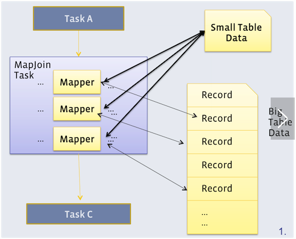

### Hive的join优化

---摘自网络

[]: http://www.360doc.com/content/18/0801/16/58315048_774947617.shtml

------

现实环境中会进行大量的表连接操作，而且表连接操作通常会耗费很懂时间。因此掌握一些基本的JOIN优化方法成为熟练运用Hive、提高工作效率的基本手段。下面讨论一些常用的JOIN优化方法。

# 1. MAP-JOIN

本文一开始介绍了Hive中JOIN的基本原理，这种JOIN没有数据大小的限制，理论上可以用于任何情形。但缺点是：需要map端和reduce端两个阶段，而且JOIN操作是在reduce端完成的，称为reduce side join。

那么，能否省略reduce端，直接在map端执行的“map side join”操作呢？？答案是，可以的。

但有个条件，就是：连接的表中必须有一个小表足以放到每个mapper所在的机器的内存中。

下图展示了map side join的原理。



从上图中可以看出，每个mapper都会拿到小表的一个副本，然后每个mapper扫描大表中的一部分数据，与各自的小表副本完成连接操作，这样就可以在map端完成连接操作。

那多大的表才算是“小表”呢？？

默认情况下，25M以下的表是“小表”，该属性由`hive.smalltable.filesize`决定。

有两种方法使用map side join:

- 直接在SELECT语句中指定“小表”，语法是/*+MAPJOIN (tbl)*/，其中tbl就是要复制到每个mapper中去的小表。例如：

```
SELECT
  /*+ MAPJOIN(my_order)*/
  u.name,
  o.orderid
FROM my_user u
LEFT OUTER JOIN my_order o ON u.uid = o.uid;

```

- 设置`hive.auto.convert.join = true`，这样hive会自动判断当前的join操作是否合适做map join，主要是找join的两个表中有没有小表。

但JOIN的两个表都不是“小表”的时候该怎么办呢？？这就需要BUCKET MAP JOIN上场了。

# 2. BUCKET MAP JOIN

Map side join固然得人心，但终会有“小表”条件不满足的时候。这就需要bucket map join了。

Bucket map join需要待连接的两个表在连接字段上进行分桶（每个分桶对应hdfs上的一个文件），而且小表的桶数需要时大表桶数的倍数。建立分桶表的例子：

```
CREATE TABLE my_user
(
  uid INT,
  name STRING
)
CLUSTERED BY (uid) into 32 buckets
STORED AS TEXTFILE;

```

这样，my_user表就对应32个桶，数据根据uid的hash value 与32取余，然后被分发导不同的桶中。

如果两个表在连接字段上分桶，则可以执行bucket map join了。具体的：

1. 设置属性`hive.optimize.bucketmapjoin= true`控制hive 执行bucket map join；
2. 对小表的每个分桶文件建立一个hashtable，并分发到所有做连接的map端；
3. map端接受了N（N为小表分桶的个数） 个小表的hashtable，做连接 操作的时候，只需要将小表的一个hashtable 放入内存即可，然后将大表的对应的split 拿出来进行连接，所以其内存限制为小表中最大的那个hashtable 的大小

## 3. SORT MERGE BUCKET MAP JOIN

对于bucket map join中的两个表，如果每个桶内分区字段也是有序的，则还可以进行sort merge bucket map join。对于那个的建表语句为：

```
CREATE TABLE my_user
(
  uid INT,
  name STRING
)
CLUSTERED BY (uid) SORTED BY (uid) into 32 buckets
STORED AS TEXTFILE;

```

这样一来当两边bucket要做局部join的时候，只需要用类似merge sort算法中的merge操作一样把两个bucket顺序遍历一遍即可完成，这样甚至都不用把一个bucket完整的加载成hashtable，而且可以做全连接操作。

进行sort merge bucket map join时，需要设置的属性为：

```
set hive.optimize.bucketmapjoin= true;
set hive.optimize.bucketmapjoin.sortedmerge = true;
set hive.input.format = org.apache.hadoop.hive.ql.io.BucketizedHiveInputFormat;

```

# 4.各种JOIN对比

| JOIN类型                   | 优点                                           | 缺点                                                    |
| -------------------------- | ---------------------------------------------- | ------------------------------------------------------- |
| COMMON JOIN                | 可以完成各种JOIN操作，不受表大小和表格式的限制 | 无法只在map端完成JOIN操作，耗时长，占用更多地网络资源   |
| MAP JOIN                   | 可以在map端完成JOIN操作，执行时间短            | 待连接的两个表必须有一个“小表”，“小表”必须加载内存中    |
| BUCKET MAP JOIN            | 可以完成MAP JOIN，不受“小表”限制               | 表必须分桶，做连接时小表分桶对应hashtable需要加载到内存 |
| SORT MERGE BUCKET MAP JOIN | 执行时间短，可以做全连接，几乎不受内存限制     | 表必须分桶，而且桶内数据有序                            |

