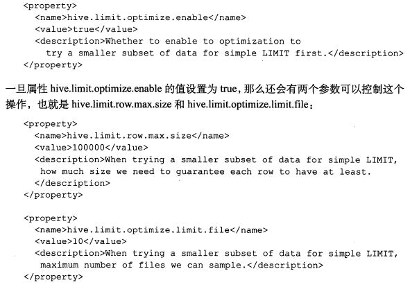
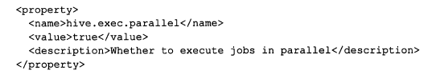
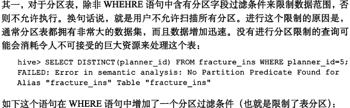
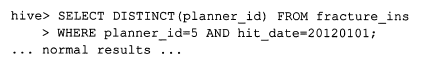

### Hive调优

---摘自网络、Hive编程指南

[]: https://blog.csdn.net/shenfuli/article/details/50593056

------

# 1. 使用EXPLAIN

通过EXPLAIN功能，可以帮助我们了解如何将查询转化成MapReduce任务的

hive (default)> explain select sum(number) from onecol;

# 2. EXPLAIN EXTENDED

使用EXPLAIN EXTENDED 语句可以产生更多的输出信息。可以比较Reduce Operator Tree。

hive (default)> explain extended select sum(number) from onecol;

# 3. LIMIT限制调整

一般情况下，LIMIT语句需要执行整个查询局域，然后在返回部分结果的。因此这种情况通常是浪费的，所以应该进可能地避免出现这种情况。Hive有一个配置属性可以开启，当使用LIMIT语句时，其可以对数据源进行抽样：

# 4. JOIN优化

[]: https://github.com/hellohappyworld/Hadoop/blob/Hive/Hive/doc/16.Hive%E7%9A%84join%E4%BC%98%E5%8C%96.md

# 5. 本地模式

对于大多数情况，Hive可以通过本地模式在单台机器上处理所有任务。对于小数据，执行时间可以明显被缩短。通过set hive.exec.mode.local.auto=true设置本地模式。

# 6. 并行模式

Hive会将一个查询转化成一个或者多个阶段。这样的阶段可以是MapReduce阶段、抽样阶段、合并阶段、limit阶段。默认情况下，Hive一次只会执行一个阶段，由于job包含多个阶段，而这些阶段并非完全互相依赖，即：这些阶段可以并行执行，可以缩短整个job的执行时间。设置参数：set hive.exec.parallel=true,或者通过配置文件来完成。

# 7. 严格模式

Hive提供一个严格模式，可以防止用户执行那些可能产生意想不到的不好影响的查询，通过设置

Hive.mapred.mode=strict可以禁止下述3种类型的查询.

## 7.1 分区表限制

Where语句的条件字段如果是非分区字段，则要求必须通过limit限制来执行。

## 7.2 ORDER BY语句

## 7.3 限制笛卡尔乘积

# 8. 调整mapper和reducer个数

# 9. JVM重用

# 10. 推测执行