# 课程内容

## 1、Kafka是什么（了解）

在流式计算中，Kafka一般用来缓存数据，Storm通过消费Kafka的数据进行计算。

 

KAFKA + STORM+REDIS 

 

l Apache Kafka是一个开源**消息**系统，由Scala写成。是由Apache软件基金会开发的一个开源消息系统项目。

l Kafka最初是由LinkedIn开发，并于2011年初开源。2012年10月从Apache Incubator毕业。该项目的目标是为处理实时数据提供一个统一、高吞吐量、低等待的平台。

l **Kafka****是一个分布式消息队列：生产者、消费者的功能。它提供了类似于JMS****的特性，但是在设计实现上完全不同，此外它并不是JMS****规范的实现****。**

l Kafka对消息保存时根据Topic进行归类，发送消息者称为Producer,消息接受者称为Consumer,此外kafka集群有多个kafka实例组成，每个实例(server)称为[broker]()。

l 无论是kafka集群，还是producer和consumer都依赖于**zookeeper**集群保存一些meta信息，来保证系统可用性

## 2、JMS是什么（了解）

### 2.1、JMS的基础

​         JMS是什么：JMS是Java提供的一套技术规范

JMS干什么用：用来异构系统 集成通信，缓解系统瓶颈，提高系统的伸缩性增强系统用户体验，使得系统模块化和组件化变得可行并更加灵活

通过什么方式：生产消费者模式（生产者、服务器、消费者）

​                              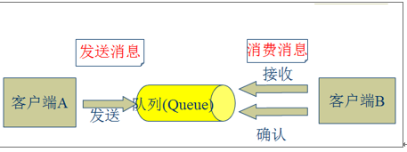

jdk，kafka，activemq……

### 2.2、JMS消息传输模型

l 点对点模式**（一对一，消费者主动拉取数据，消息收到后消息清除）**

点对点模型通常是一个基于拉取或者轮询的消息传送模型，这种模型从队列中请求信息，而不是将消息推送到客户端。这个模型的特点是发送到队列的消息被**一个且只有一个接收者接收处理**，即使有多个消息监听者也是如此。

l 发布/订阅模式**（一对多，数据生产后，推送给所有订阅者）**

发布订阅模型则是一个基于推送的消息传送模型。发布订阅模型可以有多种不同的订阅者，临时订阅者只在主动监听主题时才接收消息，而持久订阅者则监听主题的所有消息，即当前订阅者不可用，处于离线状态。

 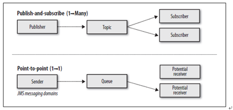

queue.put（object）  数据生产

queue.take(object)   数据消费

### 2.3、JMS核心组件

l Destination：消息发送的目的地，也就是前面说的Queue和Topic。

l Message ：从字面上就可以看出是被发送的[消息]()[[l1\]](#_msocom_1) 。

l Producer： 消息的生产者，要发送一个消息，必须通过这个生产者来发送。

l MessageConsumer： 与生产者相对应，这是消息的消费者或接收者，通过它来接收一个消息。

 

 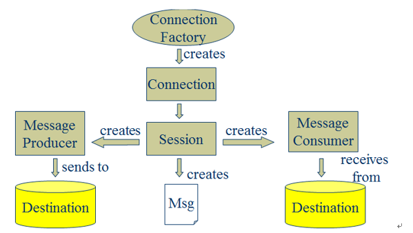

通过与ConnectionFactory可以获得一个connection

通过connection可以获得一个session会话。

 

### 2.4、常见的类JMS消息服务器

#### 2.4.1、JMS消息服务器 ActiveMQ

ActiveMQ 是Apache出品，最流行的，能力强劲的开源消息总线。ActiveMQ 是一个完全支持JMS1.1和J2EE 1.4规范的。

主要特点：

l 多种语言和协议编写客户端。语言: Java, C, C++, C#, Ruby, Perl, Python, PHP。应用协议: OpenWire,Stomp REST,WSNotification,XMPP,AMQP

l 完全支持JMS1.1和J2EE 1.4规范 (持久化,XA消息,事务)

l 对Spring的支持,ActiveMQ可以很容易内嵌到使用Spring的系统里面去,而且也支持Spring2.0的特性

l 通过了常见J2EE服务器(如 Geronimo,JBoss 4, GlassFish,WebLogic)的测试,其中通过JCA 1.5 resource adaptors的配置,可以让ActiveMQ可以自动的部署到任何兼容J2EE 1.4 商业服务器上

l 支持多种传送协议:in-VM,TCP,SSL,NIO,UDP,JGroups,JXTA

l 支持通过JDBC和journal提供高速的消息持久化

l 从设计上保证了高性能的集群,客户端-服务器,点对点

l 支持Ajax

l 支持与Axis的整合

l 可以很容易得调用内嵌JMS provider,进行测试

#### 2.4.2、分布式消息中间件 Metamorphosis

[Metamorphosis]()(MetaQ) 是一个高性能、高可用、可扩展的分布式消息中间件，类似于LinkedIn的Kafka，具有消息存储顺序写、吞吐量大和支持本地和XA事务等特性，适用于大吞吐量、顺序消息、广播和日志数据传输等场景，在淘宝和支付宝有着广泛的应用，现已开源。

主要特点：

l 生产者、服务器和消费者都可分布

l 消息存储顺序写

l 性能极高,吞吐量大

l 支持消息顺序

l 支持本地和XA事务

l 客户端pull，随机读,利用sendfile系统调用，zero-copy ,批量拉数据

l 支持消费端事务

l 支持消息广播模式

l 支持异步发送消息

l 支持http协议

l 支持消息重试和recover

l 数据迁移、扩容对用户透明

l 消费状态保存在客户端

l 支持同步和异步复制两种HA

l 支持group commit

#### 2.4.3、分布式消息中间件 RocketMQ

RocketMQ 是一款分布式、队列模型的消息中间件，具有以下特点：

l 能够保证严格的消息顺序

l 提供丰富的消息拉取模式

l 高效的订阅者水平扩展能力

l 实时的消息订阅机制

l 亿级消息堆积能力

l **Metaq3.0 ****版本改名，产品名称改为RocketMQ**

#### 2.4.4、其他MQ

l .NET消息中间件 DotNetMQ

l 基于HBase的消息队列 HQueue

l Go 的 MQ 框架 KiteQ

l AMQP消息服务器 [RabbitMQ]()

l MemcacheQ 是一个基于 MemcacheDB 的消息队列服务器。

** **

 

## 3、为什么需要消息队列（重要、了解）

消息系统的核心作用就是三点：解耦，异步和并行

以用户注册的案列来说明消息系统的作用

### 3.1、用户注册的一般流程

 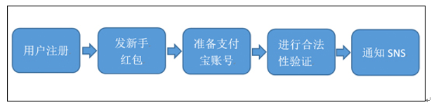

**问题**：随着后端流程越来越多，每步流程都需要额外的耗费很多时间，从而会导致用户更长的等待延迟。

### 3.2、用户注册的并行执行

 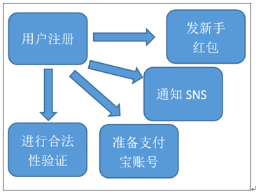

**问题**：系统并行的发起了4个请求，4个请求中，如果某一个环节执行1分钟，其他环节再快，用户也需要等待1分钟。如果其中一个环节异常之后，整个服务挂掉了。

 

### 3.3、用户注册的最终一致

 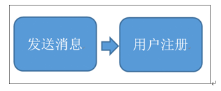

1、  **保证主流程的正常执行**、执行成功之后，发送MQ消息出去。

2、  需要这个destination的其他系统通过消费数据再执行，最终一致。

 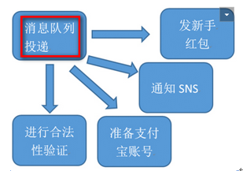

## 4、Kafka核心组件（重要）

l Topic ：消息根据Topic进行归类

l Producer：发送消息者

l Consumer：消息接受者

l broker：每个kafka实例(server)

l Zookeeper：依赖集群保存meta信息。

 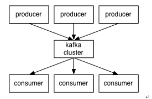

### 4.1、Kafka整体结构图

Kafka名词解释和工作方式

 

l  Producer ：消息生产者，就是向kafka broker发消息的客户端。

l  Consumer ：消息消费者，向kafka broker取消息的客户端

l  Topic ：我们可以理解为一个队列。

l  Consumer Group （CG）：这是kafka用来实现一个topic消息的广播（发给所有的consumer）和单播（发给任意一个consumer）的手段。一个topic可以有多个CG。topic的消息会复制（不是真的复制，是概念上的）到所有的CG，但每个partion只会把消息发给该CG中的一个consumer。如果需要实现广播，只要每个consumer有一个独立的CG就可以了。要实现单播只要所有的consumer在同一个CG。用CG还可以将consumer进行自由的分组而不需要多次发送消息到不同的topic。

l  Broker ：一台kafka服务器就是一个broker。一个集群由多个broker组成。一个broker可以容纳多个topic。

l  Partition：为了实现扩展性，一个非常大的topic可以分布到多个broker（即服务器）上，一个topic可以分为多个partition，每个partition是一个有序的队列。partition中的每条消息都会被分配一个有序的id（offset）。kafka只保证按一个partition中的顺序将消息发给consumer，不保证一个topic的整体（多个partition间）的顺序。

l  Offset：kafka的存储文件都是按照offset.kafka来命名，用offset做名字的好处是方便查找。例如你想找位于2049的位置，只要找到2048.kafka的文件即可。当然the first offset就是00000000000.kafka。

### 4.2、Consumer与topic关系

本质上kafka只支持Topic；

l  每个group中可以有多个consumer，每个consumer属于一个consumer group；

通常情况下，一个group中会包含多个consumer，这样不仅可以提高topic中消息的并发消费能力，而且还能提高"故障容错"性，如果group中的某个consumer失效那么其消费的partitions将会有其他consumer自动接管。

l  对于Topic中的一条特定的消息，只会被订阅此Topic的每个group中的其中一个consumer消费，此消息不会发送给一个group的多个consumer；

那么一个group中所有的consumer将会交错的消费整个Topic，每个group中consumer消息消费互相独立，我们可以认为一个group是一个"订阅"者。

l  在kafka中,一个partition中的消息只会被group中的一个consumer消费**(****同一时刻)**；

一个Topic中的每个partition，只会被一个"订阅者"中的一个consumer消费，不过一个consumer可以同时消费多个partition中的消息。

l  kafka的设计原理决定,对于一个topic，同一个group中不能有多于partition个数的consumer同时消费，否则将意味着某些consumer将无法得到消息。

**kafka****只能保证一个partition****中的消息被某个consumer****消费时是顺序的；事实上，从Topic****角度来说,****当有多个partitions****时,****消息仍不是全局有序的。**

### 4.3、Kafka消息的分发

**Producer****客户端负责消息的分发**

l  kafka集群中的任何一个broker都可以向producer提供metadata信息,这些metadata中包含"集群中存活的servers列表"/"partitions leader列表"等信息；

l  当producer获取到metadata信息之后, producer将会和Topic下所有partition leader保持socket连接；

l  消息由producer直接通过socket发送到broker，中间不会经过任何"路由层"，事实上，消息被路由到哪个partition上由producer客户端决定；

比如可以采用"random""key-hash""轮询"等,**如果一个topic****中有多个partitions,****那么在producer****端实现"****消息均衡分发"****是必要的。**

l  在producer端的配置文件中,开发者可以指定partition路由的方式。

 

Producer消息发送的应答机制

设置发送数据是否需要服务端的反馈,有三个值0,1,-1

0: producer不会等待broker发送ack 

1: 当leader接收到消息之后发送ack 

-1: 当所有的follower都同步消息成功后发送ack

​         request.required.acks=0

### **4.4****、**Consumer的负载均衡

当一个group中,有consumer加入或者离开时,会触发partitions负载均衡.负载均衡的最终目的,是提升topic的并发消费能力，步骤如下：

1、   假如topic1,具有如下partitions: P0,P1,P2,P3

2、   加入group中,有如下consumer: C1,C2

3、   首先根据partition索引号对partitions排序: P0,P1,P2,P3

4、   根据consumer.id排序: C1,C2

5、   计算倍数: M = [P0,P1,P2,P3].size / [C1,C2].size,本例值M=2(向上取整)

6、   然后依次分配partitions: C1 = [P0,P3],C2=[P1,P2],即Ci = [P(i * M),P((i + 1) * M -1)]

 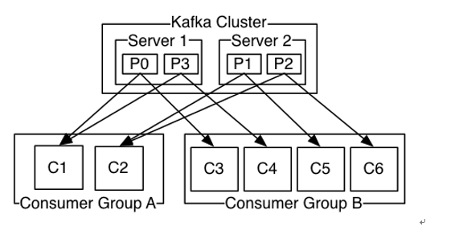

 

## 5、Kafka集群部署

### 5.1集群部署的基本流程

下载安装包、解压安装包、修改配置文件、分发安装包、启动集群

### 5.2集群部署的基础环境准备

安装前的准备工作（zk集群已经部署完毕）

l 关闭防火墙 

chkconfig iptables off && setenforce 0

l 创建用户

groupadd realtime &&　useradd realtime　&& usermod -a -G realtime realtime

l 创建工作目录并赋权

mkdir /export

mkdir /export/servers

chmod 755 -R /export

l 切换到realtime用户下

su realtime

### 5.3 Kafka集群部署 

#### 5.3.1、下载安装包

<http://kafka.apache.org/downloads.html>

在linux中使用wget命令下载安装包

​        wgethttp://mirrors.hust.edu.cn/apache/kafka/1.1.0/kafka_2.11-1.1.0.tgz.tgz

#### 5.3.2、解压安装包

tar -zxvf/export/software/kafka_2.11-1.1.0.tgz -C /export/servers/

cd/export/servers/

ln -s kafka_2.11-1.1.0 kafka

#### 5.3.3、修改配置文件

cp   /export/servers/kafka/config/server.properties

/export/servers/kafka/config/server.properties.bak

vi  /export/servers/kafka/config/server.properties

 

consumer.properties更改zookeeper.connect=zk01:2181,zk02:2181,zk03:2181

server.properties更改zookeeper.connect=192.168.52.106:2181,192.168.52.107:2181,192.168.52.108:2181

输入以下内容：

 

#### 5.3.4、分发安装包

scp -r/export/servers/kafka_2.11-0.8.2.2 kafka02:/export/servers

然后分别在各机器上创建软连

cd /export/servers/

ln -s kafka_2.11-0.8.2.2 kafka

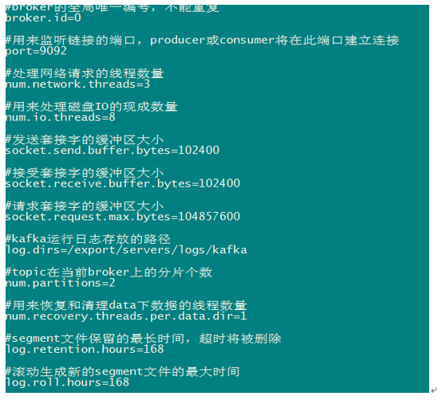

#### 5.3.5、再次修改配置文件（重要）

依次修改各服务器上配置文件的的broker.id，分别是0,1,2不得重复。

** **

#### 5.3.6、启动集群

依次在各节点上启动kafka

nohup bin/kafka-server-start.sh config/server.properties &

 

### 5.4、Kafka常用操作命令

l 查看当前服务器中的所有topic

bin/kafka-topics.sh --list --zookeeper node01:2181

l 创建topic

bin/[kafka-topics.sh --create --zookeeper node01:2181]()[--replication-factor 1]() --partitions 1 --topic test

l 删除topic

bin/kafka-topics.sh --delete --zookeeper node01:2181 --topic test

需要server.properties中设置delete.topic.enable=true否则只是标记删除或者直接重启。

l 通过shell命令发送消息

[bin/kafka-console-producer.sh --broker-list node01:9092 --topic test1]()

l 通过shell消费消息

bin/kafka-console-consumer.sh --zookeeper node01:2181--from-beginning --topic test1

l 查看消费位置

bin/kafka-run-class.sh kafka.tools.ConsumerOffsetChecker --zookeepernode01:2181 --group testGroup

l 查看某个Topic的详情

bin/kafka-topics.sh --topic test --describe --zookeeper node01:2181

l 对分区数进行修改

[bin/kafka-topics.sh --zookeeper  node01 --alter --partitions 15 --topic utopic]()

 

## 6、Kafka生产者Java API（了解）

 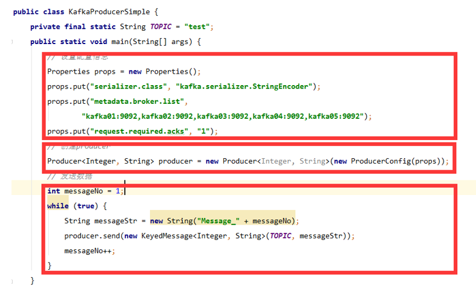

## 7、Kafka消费者Java API（了解）

 

## 8、配置文件梳理（理解）

 

## [9]()、kafka文件存储机制

### 9.1、Kafka文件存储基本结构

l 在Kafka文件存储中，同一个topic下有多个不同partition，每个partition为一个分区，partiton命名规则为topic名称+有序序号，第一个partiton序号从0开始，序号最大值为partitions数量减1。

l 每个partion(分区)相当于一个巨型文件被平均分配到多个大小相等segment(段)数据文件中。**但每个段****segmentfile****消息数量不一定相等**，这种特性方便old segment file快速被删除。默认保留7天的数据。

 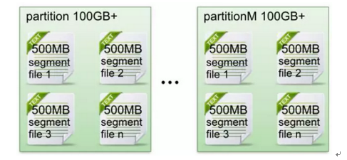

l 每个partiton只需要支持顺序读写就行了，segment文件生命周期由服务端配置参数决定。（什么时候创建，什么时候删除）

 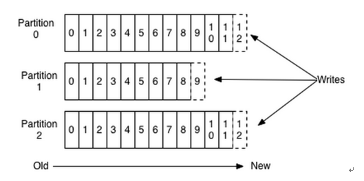

**数据有序的讨论？**

​         一个partition的数据是否是有序的？          间隔性有序，不连续

​         针对一个topic里面的数据，只能做到partition内部有序，不能做到全局有序。

​         特别加入消费者的场景后，如何保证消费者消费的数据全局有序的？伪命题。

 

只有一种情况下才能保证全局有序？就是只有一个partition。

### 9.2、Kafka Partition Segment

l Segmentfile组成：由2大部分组成，分别为index file和data file，此2个文件一一对应，成对出现，后缀".index"和“.log”分别表示为segment索引文件、数据文件。

 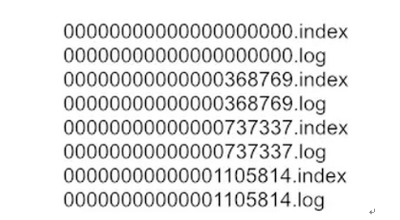

l Segment文件命名规则：partion全局的第一个segment从0开始，后续每个segment文件名为上一个segment文件最后一条消息的offset值。数值最大为64位long大小，19位数字字符长度，没有数字用0填充。

l 索引文件存储大量元数据，数据文件存储大量消息，索引文件中元数据指向对应数据文件中message的物理偏移地址。

 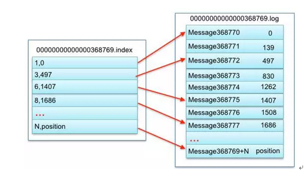

3，497：当前log文件中的第几条信息，存放在磁盘上的那个地方

 

上述图中索引文件存储大量元数据，数据文件存储大量消息，索引文件中元数据指向对应数据文件中message的物理偏移地址。

其中以索引文件中元数据3,497为例，依次在数据文件中表示第3个message(在全局partiton表示第368772个message)、以及该消息的物理偏移地址为497。

 

l segment data file由许多message组成， qq物理结构如下：

| **关键字******       | **解释说明******                                             |
| -------------------- | ------------------------------------------------------------ |
| 8 byte offset        | 在parition(分区)内的每条消息都有一个有序的id号，这个id号被称为偏移(offset),它可以唯一确定每条消息在parition(分区)内的位置。即offset表示partiion的第多少message |
| 4 byte message  size | message大小                                                  |
| 4 byte CRC32         | 用crc32校验message                                           |
| 1 byte “magic"       | 表示本次发布Kafka服务程序协议版本号                          |
| 1 byte “attributes"  | 表示为独立版本、或标识压缩类型、或编码类型。                 |
| 4 byte key  length   | 表示key的长度,当key为-1时，K byte key字段不填                |
| K byte key           | 可选                                                         |
| value bytes  payload | 表示实际消息数据。                                           |

 

 

### 9.3、Kafka 查找message

读取offset=368776的message，需要通过下面2个步骤查找。

​          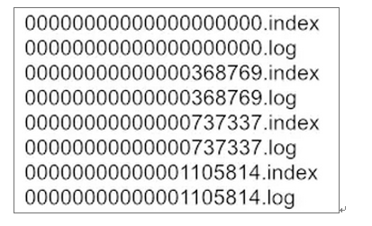

#### 9.3.1、查找segment file

00000000000000000000.index表示最开始的文件，起始偏移量(offset)为1

00000000000000368769.index的消息量起始偏移量为368770 = 368769 + 1

00000000000000737337.index的起始偏移量为737338=737337 + 1

其他后续文件依次类推。

以起始偏移量命名并排序这些文件，只要根据offset **二分查找**文件列表，就可以快速定位到具体文件。当offset=368776时定位到00000000000000368769.index和对应log文件。

#### 9.3.2、通过segment file查找message 

当offset=368776时，依次定位到00000000000000368769.index的元数据物理位置和00000000000000368769.log的物理偏移地址

然后再通过00000000000000368769.log顺序查找直到offset=368776为止。

## 10、kafka为什么快（了解）

不同于Redis和MemcacheQ等内存消息队列，Kafka的设计是把所有的Message都要写入速度低容量大的硬盘，以此来换取更强的存储能力。实际上，Kafka使用硬盘并没有带来过多的性能损失，“规规矩矩”的抄了一条“近道”。

 

首先，说“规规矩矩”是因为Kafka在磁盘上只做Sequence I/O，由于消息系统读写的特殊性，这并不存在什么问题。关于磁盘I/O的性能，引用一组Kafka官方给出的测试数据(Raid-5，7200rpm)：

 

Sequence I/O: 600MB/s

Random I/O: 100KB/s

 

所以通过只做Sequence I/O的限制，规避了磁盘访问速度低下对性能可能造成的影响。

 

接下来我们再聊一聊Kafka是如何“抄近道的”。

 

首先，Kafka重度依赖底层操作系统提供的PageCache功能。当上层有写操作时，操作系统只是将数据写入PageCache，同时标记Page属性为Dirty。

 

**当读操作发生时，先从PageCache****中查找，如果发生缺页才进行磁盘调度，最终返回需要的数据**。实际上PageCache是把尽可能多的空闲内存都当做了磁盘缓存来使用。同时如果有其他进程申请内存，回收PageCache的代价又很小，所以现代的OS都支持PageCache。

 

使用PageCache功能同时可以避免在JVM内部缓存数据，JVM为我们提供了强大的GC能力，同时也引入了一些问题不适用与Kafka的设计。

如果在Heap内管理缓存，JVM的GC线程会频繁扫描Heap空间，带来不必要的开销。如果Heap过大，执行一次Full GC对系统的可用性来说将是极大的挑战。

所有在在JVM内的对象都不免带有一个Object Overhead(千万不可小视)，内存的有效空间利用率会因此降低。

所有的In-Process Cache在OS中都有一份同样的PageCache。所以通过将缓存只放在PageCache，可以至少让可用缓存空间翻倍。

如果Kafka重启，所有的In-Process Cache都会失效，而OS管理的PageCache依然可以继续使用。

 

PageCache还只是第一步，Kafka为了进一步的优化性能还采用了Sendfile技术。在解释Sendfile之前，首先介绍一下传统的网络I/O操作流程，大体上分为以下4步。

 

OS 从硬盘把数据读到内核区的PageCache。

用户进程把数据从内核区Copy到用户区。

然后用户进程再把数据写入到Socket，数据流入内核区的Socket Buffer上。

OS 再把数据从Buffer中Copy到网卡的Buffer上，这样完成一次发送。

 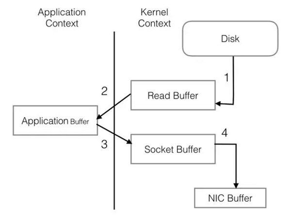

 

整个过程共经历两次Context Switch，四次System Call。同一份数据在内核Buffer与用户Buffer之间重复拷贝，效率低下。其中2、3两步没有必要，完全可以直接在内核区完成数据拷贝。这也正是Sendfile所解决的问题，经过Sendfile优化后，整个I/O过程就变成了下面这个样子。

 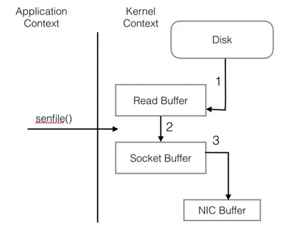

 

通过以上的介绍不难看出，Kafka的设计初衷是尽一切努力在内存中完成数据交换，无论是对外作为一整个消息系统，或是内部同底层操作系统的交互。如果Producer和Consumer之间生产和消费进度上配合得当，完全可以实现数据交换零I/O。这也就是我为什么说Kafka使用“硬盘”并没有带来过多性能损失的原因。下面是我在生产环境中采到的一些指标。

(20 Brokers, 75 Partitions per Broker, 110kmsg/s)

 

此时的集群只有写，没有读操作。10M/s左右的Send的流量是Partition之间进行Replicate而产生的。从recv和writ的速率比较可以看出，写盘是使用Asynchronous+Batch的方式，底层OS可能还会进行磁盘写顺序优化。而在有Read Request进来的时候分为两种情况，第一种是内存中完成数据交换。

 

Send流量从平均10M/s增加到了到平均60M/s，而磁盘Read只有不超过50KB/s。PageCache降低磁盘I/O效果非常明显。

 

接下来是读一些收到了一段时间，已经从内存中被换出刷写到磁盘上的老数据。

 

其他指标还是老样子，而磁盘Read已经飚高到40+MB/s。此时全部的数据都已经是走硬盘了(对硬盘的顺序读取OS层会进行Prefill PageCache的优化)。依然没有任何性能问题。

 

------

 [[l1\]](#_msoanchor_1)

StreamMessage：Java 数据流消息，用标准流操作来顺序的填充和读取。

MapMessage：一个Map类型的消息；名称为 string 类型，而值为 Java 的基本类型。

TextMessage：普通字符串消息，包含一个String。

ObjectMessage：对象消息，包含一个可序列化的Java 对象

BytesMessage：二进制数组消息，包含一个byte[]。

XMLMessage:  一个XML类型的消息。

最常用的是TextMessage和ObjectMessage。

 

 