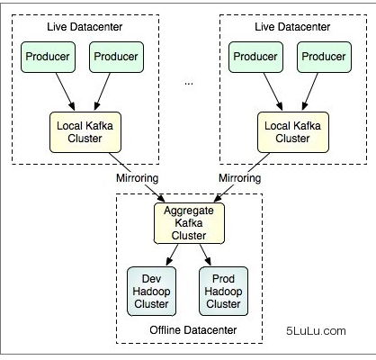
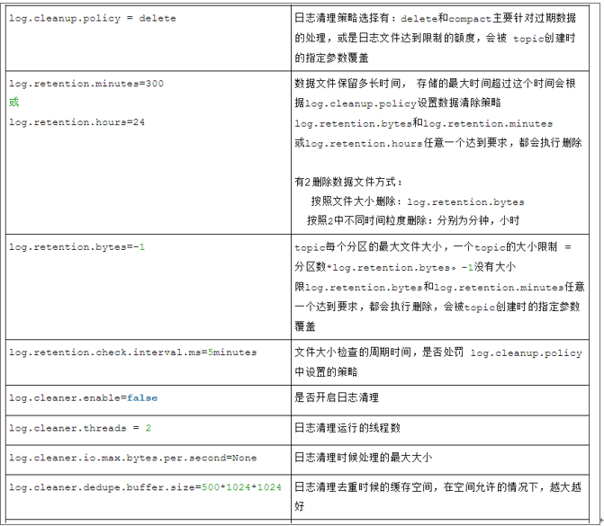

kafka常见问题

## 1、如果想消费已经被消费过的数据

consumer是底层采用的是一个阻塞队列，只要一有producer生产数据，那consumer就会将数据消费。当然这里会产生一个很严重的问题，如果你重启一消费者程序，那你连一条数据都抓不到，但是log文件中明明可以看到所有数据都好好的存在。换句话说，一旦你消费过这些数据，那你就无法再次用同一个groupid消费同一组数据了。

原因：消费者消费了数据并不从队列中移除，只是记录了offset偏移量。同一个consumergroup的所有consumer合起来消费一个topic，并且他们每次消费的时候都会保存一个offset参数在zookeeper的root上。如果此时某个consumer挂了或者新增一个consumer进程，将会触发kafka的负载均衡，暂时性的重启所有consumer，重新分配哪个consumer去消费哪个partition，然后再继续通过保存在zookeeper上的offset参数继续读取数据。注意:offset保存的是consumer 组消费的消息偏移。

要消费同一组数据，你可以

1)        采用不同的group。

2)        通过一些配置，就可以将线上产生的数据同步到镜像中去，然后再由特定的集群区处理大批量的数据。

## 2、如何自定义去消费已经消费过的数据

Conosumer.properties配置文件中有两个重要参数

auto.commit.enable：如果为true，则consumer的消费偏移offset会被记录到zookeeper。下次consumer启动时会从此位置继续消费。

auto.offset.reset  该参数只接受两个常量largest和Smallest,分别表示将当前offset指到日志文件的最开始位置和最近的位置。

如果进一步想控制时间，则需要调用SimpleConsumer，自己去设置相关参数。比较重要的参数是 kafka.api.OffsetRequest.EarliestTime()和kafka.api.OffsetRequest.LatestTime()分别表示从日志（数据）的开始位置读取和只读取最新日志。

如何使用SimpleConsumer

首先，你必须知道读哪个topic的哪个partition

然后，找到负责该partition的broker leader，从而找到存有该partition副本的那个broker

再者，自己去写request并fetch数据

最终，还要注意需要识别和处理brokerleader的改变

## 3、kafka partition和consumer数目关系

1)        如果consumer比partition多，是浪费，因为kafka的设计是在一个partition上是不允许并发的，所以consumer数不要大于partition数 。

2)        如果consumer比partition少，一个consumer会对应于多个partitions，这里主要合理分配consumer数和partition数，否则会导致partition里面的数据被取的不均匀。最好partiton数目是consumer数目的整数倍，所以partition数目很重要，比如取24，就很容易设定consumer数目 。

3)        如果consumer从多个partition读到数据，不保证数据间的顺序性，kafka只保证在一个partition上数据是有序的，但多个partition，根据你读的顺序会有不同

4)        增减consumer，broker，partition会导致rebalance，所以rebalance后consumer对应的partition会发生变化 

## 4、kafka topic 副本问题

Kafka尽量将所有的Partition均匀分配到整个集群上。一个典型的部署方式是一个Topic的Partition数量大于Broker的数量。

1)        如何分配副本:

Producer在发布消息到某个Partition时，先通过ZooKeeper找到该Partition的Leader，然后无论该Topic的Replication Factor为多少（也即该Partition有多少个Replica），Producer只将该消息发送到该Partition的Leader。Leader会将该消息写入其本地Log。每个Follower都从Leader pull数据。这种方式上，Follower存储的数据顺序与Leader保持一致。

2)        Kafka分配Replica的算法如下：

将所有Broker（假设共n个Broker）和待分配的Partition排序

将第i个Partition分配到第（imod n）个Broker上

将第i个Partition的第j个Replica分配到第（(i + j) mode n）个Broker上 

## 5、kafka如何设置生存周期与清理数据

日志文件的删除策略非常简单:启动一个后台线程定期扫描log file列表,把保存时间超过阀值的文件直接删除(根据文件的创建时间).清理参数在server.properties文件中：

## 6、zookeeper如何管理kafka   

1)      Producer端使用zookeeper用来"发现"broker列表,以及和Topic下每个partition leader建立socket连接并发送消息.

2)      Broker端使用zookeeper用来注册broker信息,以及监测partition leader存活性.

3)      Consumer端使用zookeeper用来注册consumer信息,其中包括consumer消费的partition列表等,同时也用来发现broker列表,并和partition leader建立socket连接,并获取消息.

##  7.partitions的[设计](http://cpro.baidu.com/cpro/ui/uijs.php?rs=1&u=http%3A%2F%2Fwww%2Eaboutyun%2Ecom%2Fthread%2D9341%2D1%2D1%2Ehtml&p=baidu&c=news&n=10&t=tpclicked3_hc&q=92051019_cpr&k=%C9%E8%BC%C6&k0=java&kdi0=8&k1=%B1%E0%B3%CC&kdi1=8&k2=%BF%CD%BB%A7%B6%CB&kdi2=8&k3=%C9%E8%BC%C6&kdi3=8&k4=server&kdi4=1&sid=4ebca4a25f27e407&ch=0&tu=u1692056&jk=fb2f0911808fa875&cf=29&fv=14&stid=9&urlid=0&luki=4&seller_id=1&di=128)目的

 partitions的[设计](http://cpro.baidu.com/cpro/ui/uijs.php?rs=1&u=http%3A%2F%2Fwww%2Eaboutyun%2Ecom%2Fthread%2D9341%2D1%2D1%2Ehtml&p=baidu&c=news&n=10&t=tpclicked3_hc&q=92051019_cpr&k=%C9%E8%BC%C6&k0=java&kdi0=8&k1=%B1%E0%B3%CC&kdi1=8&k2=%BF%CD%BB%A7%B6%CB&kdi2=8&k3=%C9%E8%BC%C6&kdi3=8&k4=server&kdi4=1&sid=4ebca4a25f27e407&ch=0&tu=u1692056&jk=fb2f0911808fa875&cf=29&fv=14&stid=9&urlid=0&luki=4&seller_id=1&di=128)目的有多个.最根本原因是kafka基于文件存储.通过分区,可以将日志内容分散到多个[server](http://cpro.baidu.com/cpro/ui/uijs.php?rs=1&u=http%3A%2F%2Fwww%2Eaboutyun%2Ecom%2Fthread%2D9341%2D1%2D1%2Ehtml&p=baidu&c=news&n=10&t=tpclicked3_hc&q=92051019_cpr&k=server&k0=java&kdi0=8&k1=%B1%E0%B3%CC&kdi1=8&k2=%BF%CD%BB%A7%B6%CB&kdi2=8&k3=%C9%E8%BC%C6&kdi3=8&k4=server&kdi4=1&sid=4ebca4a25f27e407&ch=0&tu=u1692056&jk=fb2f0911808fa875&cf=29&fv=14&stid=9&urlid=0&luki=5&seller_id=1&di=128)上,来避免文件尺寸达到单机磁盘的上限,每个partiton都会被当前server(kafka实例)保存;可以将一个topic切分多任意多个partitions,来消息保存/消费的效率.此外越多的partitions意味着可以容纳更多的consumer,有效提升并发消费的能力.

## 8.partition的leader问题

每个partition都有一个[server](http://cpro.baidu.com/cpro/ui/uijs.php?rs=1&u=http%3A%2F%2Fwww%2Eaboutyun%2Ecom%2Fthread%2D9341%2D1%2D1%2Ehtml&p=baidu&c=news&n=10&t=tpclicked3_hc&q=92051019_cpr&k=server&k0=java&kdi0=8&k1=%B1%E0%B3%CC&kdi1=8&k2=%BF%CD%BB%A7%B6%CB&kdi2=8&k3=%C9%E8%BC%C6&kdi3=8&k4=server&kdi4=1&sid=4ebca4a25f27e407&ch=0&tu=u1692056&jk=fb2f0911808fa875&cf=29&fv=14&stid=9&urlid=0&luki=5&seller_id=1&di=128)为"leader";leader负责所有的读写操作,如果leader失效,那么将会有其他follower来接管(成为新的leader);follower只是单调的和leader跟进,同步消息即可..由此可见作为leader的server承载了全部的请求压力,因此从集群的整体考虑,有多少个partitions就意味着有多少个"leader",kafka会将"leader"均衡的分散在每个实例上,来确保整体的性能稳定.

