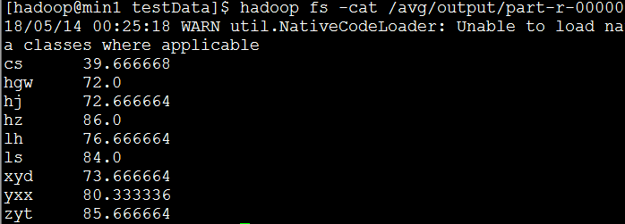

#### 算每个人的平均成绩

1. 需求

   待处理数据内容：

   ​	名字    语文     数学    英语
   ​	 lh	      92	68	    70
   ​	 zyt	      94	88	    75
   ​	 ls	      96	78	    78
   ​	hgw      90	70	    56
   ​	yxx	      80	88	    73
   ​	hz	      90	98	    70
   ​	xyd	      60	88	    73
   ​	hj	      90	58	    70
   ​	cs	      50	58	    11

   执行命令：

   

   执行结果：

   

2. 代码

```
package com.tencent.demo01.avg;

import java.io.IOException;

import org.apache.hadoop.conf.Configuration;
import org.apache.hadoop.fs.FileSystem;
import org.apache.hadoop.fs.Path;
import org.apache.hadoop.io.FloatWritable;
import org.apache.hadoop.io.LongWritable;
import org.apache.hadoop.io.NullWritable;
import org.apache.hadoop.io.Text;
import org.apache.hadoop.mapreduce.Job;
import org.apache.hadoop.mapreduce.Mapper;
import org.apache.hadoop.mapreduce.lib.input.FileInputFormat;
import org.apache.hadoop.mapreduce.lib.output.FileOutputFormat;

/**
 * 待处理数据内容：
 * 
 * 名字 语文 数学 英语
 * lh 92 68 70
 * zyt 94 88 75
 * ls 96 78 78
 * hgw 90 70 56
 * yxx 80 88 73
 * hz 90 98 70
 * xyd 60 88 73
 * hj 90 58 70
 * cs 50 58 11
 * 1. 算每个人的平均成绩？
 *
 */
public class AvgDriver {

	static class AvgMapper extends Mapper<LongWritable, Text, Text, FloatWritable> {

		@Override
		protected void map(LongWritable key, Text value,
				Mapper<LongWritable, Text, Text, FloatWritable>.Context context)
				throws IOException, InterruptedException {
			// 得到一行数据
			String line_content = value.toString();
			// 将数据按照空格切分
			String[] arr = line_content.split(" ");
			// 得到名字
			String stu_name = arr[0];
			// 得到语文成绩
			float chinese = Float.parseFloat(arr[1]);
			// 得到数学成绩
			float math = Float.parseFloat(arr[2]);
			// 得到英语成绩
			float english = Float.parseFloat(arr[3]);
			// 求给名同学的平均成绩
			float avg = (chinese + math + english) / 3.0f;
			// 将名字和平均成绩输出
			context.write(new Text(stu_name), new FloatWritable(avg));
		}

	}

	public static void main(String[] args) {
		// 获取当前配置文件
		Configuration conf = new Configuration();
		try {
			// 设置job并指定本程序的jar包所在的路径
			Job job = Job.getInstance(conf);
			job.setJarByClass(AvgDriver.class);
			// 设置Map相关属性
			job.setMapperClass(AvgMapper.class);
			job.setMapOutputKeyClass(Text.class);
			job.setMapOutputValueClass(FloatWritable.class);
			FileInputFormat.addInputPath(job, new Path("/avg/input"));
			// 设置Reduce默认输出kv类型及输出路径
			job.setOutputKeyClass(Text.class);
			job.setOutputValueClass(FloatWritable.class);
			// 判断输出目录是否存在，若存在则删除(很好用，很经典，因为当重复执行某api时，就不用手动删除之前的输出文件了)
			FileSystem fs = FileSystem.get(conf);
			if (fs.exists(new Path("/avg/output"))) {
				fs.delete(new Path("/avg/output"), true);
			}
			FileOutputFormat.setOutputPath(job, new Path("/avg/output"));
			// 将job中配置的相关参数以及job所用的java类所在的jar包提交给yarn去运行
			int result = job.waitForCompletion(true) ? 0 : 1;
			// 退出
			System.exit(result);
		} catch (Exception e) {
			// TODO Auto-generated catch block
			e.printStackTrace();
		}
	}
}

```

