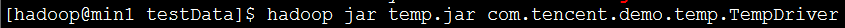
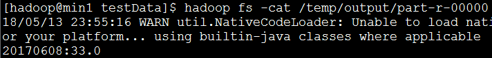

#### 											统计最高温度

1. 需求：求给定日期的最高温度

   待处理数据内容：

   ​	201701082.6

   ​	201701066

   ​	2017020810

   ​	2017030816.33

   ​	2017060833.0

   每一行的前8位是日期，从第8位往后是温度

   本程序jar包执行命令：

   执行结果：

2. 代码

   ```
   package com.tencent.demo.temp;

   import java.io.IOException;

   import org.apache.hadoop.conf.Configuration;
   import org.apache.hadoop.fs.FileSystem;
   import org.apache.hadoop.fs.Path;
   import org.apache.hadoop.io.FloatWritable;
   import org.apache.hadoop.io.NullWritable;
   import org.apache.hadoop.io.Text;
   import org.apache.hadoop.mapreduce.Job;
   import org.apache.hadoop.mapreduce.lib.input.FileInputFormat;
   import org.apache.hadoop.mapreduce.lib.output.FileOutputFormat;

   /**
    * 需求：求给定日期的最高温度
    * 
    * 待处理数据内容：
    * 
    * 201701082.6
    * 
    * 201701066
    * 
    * 2017020810
    * 
    * 2017030816.33
    * 
    * 2017060833.0
    * 
    * 每一行的前8位是日期，从第8位往后是温度
    *
    * 
    */
   public class TempDriver {
   	public static void main(String[] args) {
   		Configuration conf = new Configuration();
   		try {
   			Job job = Job.getInstance(conf, "temp");
   			job.setJarByClass(TempDriver.class);

   			job.setMapperClass(TempMapper.class);
   			job.setMapOutputKeyClass(Text.class);
   			job.setMapOutputValueClass(Text.class);
   			FileInputFormat.addInputPath(job, new Path("/temp/input"));

   			job.setReducerClass(TempReducer.class);
   			job.setOutputKeyClass(NullWritable.class);
   			job.setOutputValueClass(Text.class);
   			// 判断输出目录是否存在，若存在则删除(很好用，很经典，因为当重复执行某api时，就不用手动删除之前的输出文件了)
   			FileSystem fs = FileSystem.get(conf);
   			if (fs.exists(new Path("/temp/output"))) {
   				fs.delete(new Path("/temp/output"), true);
   			}
   			FileOutputFormat.setOutputPath(job, new Path("/temp/output"));

   			int result = job.waitForCompletion(true) ? 0 : 1;
   			System.exit(result);
   		} catch (Exception e) {
   			// TODO Auto-generated catch block
   			e.printStackTrace();
   		}
   	}
   }

   ```

```
package com.tencent.demo.temp;

import java.io.IOException;

import org.apache.hadoop.io.FloatWritable;
import org.apache.hadoop.io.LongWritable;
import org.apache.hadoop.io.Text;
import org.apache.hadoop.mapreduce.Mapper;

public class TempMapper extends Mapper<LongWritable, Text, Text, Text> {

	@Override
	protected void map(LongWritable key, Text value, Mapper<LongWritable, Text, Text, Text>.Context context)
			throws IOException, InterruptedException {
		String line_content = value.toString();// 一行的内容
		String temp = line_content.substring(8, line_content.length());// 具体的温度值
		String date = line_content.substring(0, 8);// 日期
		context.write(new Text("temp"), new Text(temp + "-" + date));
	}

}

```

```
package com.tencent.demo.temp;

import java.io.IOException;
import java.sql.Date;

import org.apache.hadoop.io.FloatWritable;
import org.apache.hadoop.io.NullWritable;
import org.apache.hadoop.io.Text;
import org.apache.hadoop.mapreduce.Reducer;

public class TempReducer extends Reducer<Text, Text, NullWritable, Text> {

	@Override//输入形式如：<temp,{33.0-20170608,16.33-20170308,10-20170208}>
	protected void reduce(Text text, Iterable<Text> values, Reducer<Text, Text, NullWritable, Text>.Context context)
			throws IOException, InterruptedException {
		float max = 0.0f;//用来保存最高温度
		String tmp_date = "";//用来保存最高温度的日期
		for (Text value : values) {

			String[] attr = value.toString().split("-");
			float temp = Float.parseFloat(attr[0]);

			if (temp > max) {
				max = temp;
				tmp_date = attr[1];
			}
		}
		//输出形式如：<20170608,33.0>
		context.write(null, new Text(tmp_date + ":" + max));
	}

}

```

