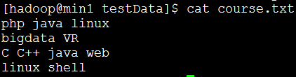
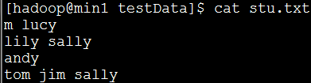
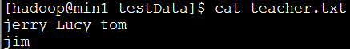
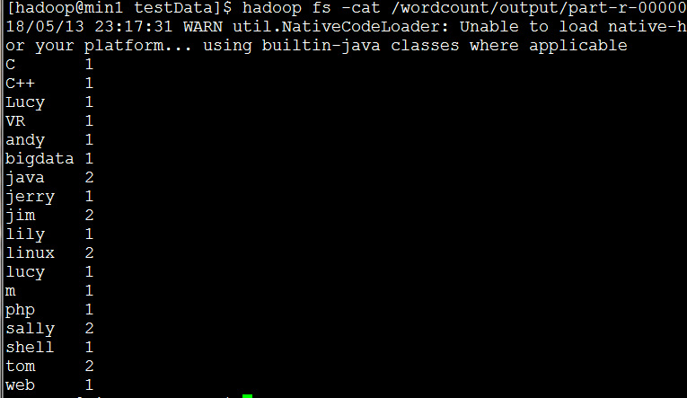

#### 											WordCount

1.需求：有一批文件（规模为TB级或者PB级），如何统计这些文件中所有单词出现次数

如有三个文件，文件名是course.txt、stu.txt 和teacher.tx





执行结果：



2.代码

```
package com.tencent.demo.wordcount;

import java.io.IOException;

import org.apache.hadoop.conf.Configuration;
import org.apache.hadoop.fs.FileSystem;
import org.apache.hadoop.fs.Path;
import org.apache.hadoop.io.IntWritable;
import org.apache.hadoop.io.Text;
import org.apache.hadoop.mapreduce.Job;
import org.apache.hadoop.mapreduce.lib.input.FileInputFormat;
import org.apache.hadoop.mapreduce.lib.output.FileOutputFormat;

/**
 * 需求将三个文本中的单词个数统计出来并输出
 * 
 * @author Administrator
 *
 */
public class WordcountDriver {
	public static void main(String[] args) {
		// 得到环境变量
		Configuration conf = new Configuration();
		try {
			// 设置job
			Job job = Job.getInstance(conf);
			// 设置本程序的jar包所在的路径
			job.setJarByClass(WordcountDriver.class);
			// 设置Map相关属性
			job.setMapperClass(MyMapper.class);
			job.setMapOutputKeyClass(Text.class);
			job.setMapOutputValueClass(IntWritable.class);
			FileInputFormat.addInputPath(job, new Path("/wordcount"));
			// 设置Reducer相关属性
			job.setReducerClass(MyReducer.class);
			job.setOutputKeyClass(Text.class);
			job.setOutputValueClass(IntWritable.class);
			// 判断输出目录是否存在，若存在则删除
			FileSystem fs = FileSystem.get(conf);
			if (fs.exists(new Path("/wordcount/output"))) {
				fs.delete(new Path("/wordcount/output"), true);
			}
			FileOutputFormat.setOutputPath(job, new Path("/wordcount/output"));

			// 将job中配置的相关参数，以及job所用的java类所用的jar包，提交给yarn去运行
			int result = job.waitForCompletion(true) ? 0 : 1;
			// 退出
			System.exit(result);
		} catch (Exception e) {
			// TODO Auto-generated catch block
			e.printStackTrace();
		}
	}
}

```

```
package com.tencent.demo.wordcount;

import java.io.IOException;

import org.apache.hadoop.io.IntWritable;
import org.apache.hadoop.io.LongWritable;
import org.apache.hadoop.io.Text;
import org.apache.hadoop.mapreduce.Mapper;

public class MyMapper extends Mapper<LongWritable, Text, Text, IntWritable> {

	@Override // 数据输出形式：<"java",1>
	protected void map(LongWritable key, Text value, Context context) throws IOException, InterruptedException {
		// 得到一行数据
		String line_content = value.toString();
		// 对一行数据进行切分(以空格为分界)
		String[] array = line_content.split(" ");
		// 将每个字符输出
		for (String a : array) {
			context.write(new Text(a), new IntWritable(1));
		}
	}
}

```

```
package com.tencent.demo.wordcount;

import java.io.IOException;

import org.apache.hadoop.io.IntWritable;
import org.apache.hadoop.io.Text;
import org.apache.hadoop.mapreduce.Reducer;

public class MyReducer extends Reducer<Text, IntWritable, Text, IntWritable> {

	@Override // 此时输入数据形式为：<"java",{1,1,1,1,1}>
	protected void reduce(Text key, Iterable<IntWritable> values,
			Reducer<Text, IntWritable, Text, IntWritable>.Context context) throws IOException, InterruptedException {
		// 设置累加器
		int count = 0;
		// 计算key值的数量
		for (IntWritable value : values) {
			count += value.get();
		}
		// 讲数据输出，输出形式： <"java",5>
		context.write(key, new IntWritable(count));
	}
}

```

