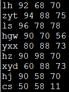
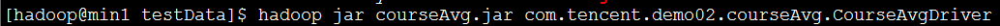
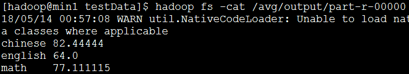

#### 求每个学科的平均成绩

1. 需求

   待处理数据内容：

   ​	名字    语文     数学    英语

   

   执行命令：

   

   执行结果：

   

2. 代码

```
package com.tencent.demo02.courseAvg;

import java.io.IOException;

import org.apache.hadoop.conf.Configuration;
import org.apache.hadoop.fs.FileSystem;
import org.apache.hadoop.fs.Path;
import org.apache.hadoop.io.FloatWritable;
import org.apache.hadoop.io.LongWritable;
import org.apache.hadoop.io.Text;
import org.apache.hadoop.mapreduce.Job;
import org.apache.hadoop.mapreduce.Mapper;
import org.apache.hadoop.mapreduce.Reducer;
import org.apache.hadoop.mapreduce.lib.input.FileInputFormat;
import org.apache.hadoop.mapreduce.lib.output.FileOutputFormat;

public class CourseAvgDriver {
	/**
	 * /** 待处理数据内容：
	 * 
	 * 名字 语文 数学 英语 {lh 92 68 70}， {zyt 94 88 75}， {ls 96 78 78}， {hgw 90 70 56}，
	 * {yxx 80 88 73}， {hz 90 98 70}， {xyd 60 88 73}， {hj 90 58 70}， {cs 50 58 11}
	 * 求每个学科的平均成绩(该处理思想是正确处理思路)
	 * 
	 */

	/**
	 * map输出类型:<chinese,92> <chinese,23> <chinese,34>
	 * reduce拿到的数据效果：<chinese,{92,23,34}>
	 */
	static class CourseAvgMapper extends Mapper<LongWritable, Text, Text, FloatWritable> {
		@Override
		protected void map(LongWritable key, Text value,
				Mapper<LongWritable, Text, Text, FloatWritable>.Context context)
				throws IOException, InterruptedException {
			// 得到一行数据
			String line_content = value.toString();
			// 将每行数据按照空格切分开
			String[] arr = line_content.split(" ");
			// 得到语文成绩
			float chinese = Float.parseFloat(arr[1]);
			// 得到数学成绩
			float math = Float.parseFloat(arr[2]);
			// 得到英语成绩
			float english = Float.parseFloat(arr[3]);
			// 分别将语文，数学，英语成绩输出
			context.write(new Text("chinese"), new FloatWritable(chinese));
			context.write(new Text("math"), new FloatWritable(math));
			context.write(new Text("english"), new FloatWritable(english));
		}
	}

	static class CourseAvgReducer extends Reducer<Text, FloatWritable, Text, FloatWritable> {

		@Override // ArrayList与Iterable最重要的区别：ArrayList中所有元素保存在内存中，会造成内存溢出，而后者保存在磁盘中不会溢出
		protected void reduce(Text key, Iterable<FloatWritable> iterable,
				Reducer<Text, FloatWritable, Text, FloatWritable>.Context context)
				throws IOException, InterruptedException {
			// 计次
			int count = 0;
			// 求和
			float sum = 0.0f;
			for (FloatWritable fw : iterable) {
				count++;
				sum += fw.get();
			}
			// 求平均值
			float avg = sum / count;
			context.write(key, new FloatWritable(avg));
		}

	}

	public static void main(String[] args) {
		// 得到当前环境变量
		Configuration conf = new Configuration();
		try {
			// 设置job并指定本程序的jar包路径
			Job job = Job.getInstance(conf, "CourseAvg");
			job.setJarByClass(CourseAvgDriver.class);
			// 设置Map
			job.setMapperClass(CourseAvgMapper.class);
			job.setMapOutputKeyClass(Text.class);
			job.setMapOutputValueClass(FloatWritable.class);
			FileInputFormat.addInputPath(job, new Path("/avg/input"));
			// 设置Reducer
			job.setReducerClass(CourseAvgReducer.class);
			job.setOutputKeyClass(Text.class);
			job.setOutputValueClass(FloatWritable.class);
			// 判断输出路径是否存在，若存在将其删除
			FileSystem fs = FileSystem.get(conf);
			if (fs.exists(new Path("/avg/output"))) {
				fs.delete(new Path("/avg/output"), true);
			}
			FileOutputFormat.setOutputPath(job, new Path("/avg/output"));
			// 将job中配置的相关参数，以及job所用的java类所在的jar包提供给yarn运行
			int result = job.waitForCompletion(true) ? 0 : 1;
			// 退出
			System.exit(result);
		} catch (Exception e) {
			// TODO Auto-generated catch block
			e.printStackTrace();
		}
	}
}

```

