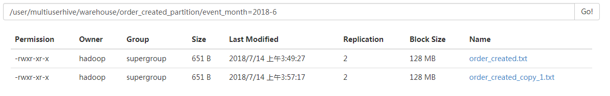

#### Hive分区表

##### 1.创建数据

```
##通过shell脚步创建数据
vi create.sh
#! /bin/bash
for i in $(seq 20)
do 
  echo -e  "$(date -d "$RANDOM minute ago"  +%F' '%T'.'%N)"
done|sort -nk1|awk '{print NR"\t"$0}'>/home/hadoop/testData/order_created.txt
cat /home/hadoop/testData/order_created.txt

产生数据：
1       2018-06-21 20:00:51.037826860
2       2018-06-22 03:04:51.040970206
3       2018-06-22 20:39:51.034481252
.....................................
18      2018-07-11 23:15:51.004664544
19      2018-07-12 23:31:51.025437365
20      2018-07-13 15:02:51.048536252
```

##### 2.静态分区表

```
##创建分区表
hive> create table order_created_partition(
    > order_number string,
    > event_time string
    > )
    > partitioned by (event_month string)
    > row format delimited fields terminated by "\t"
    > ;
-- 建表语句，指定分区字段为event_month，这个字段是伪列
-- 会在数据load到表的这个分区时，在hdfs上创建名为event_month=2017-12的子目录
##加载数据
hive> load data local inpath "/home/hadoop/testData/order_created.txt"
    > overwrite into table order_created_partition
    > partition (event_month='2018-6')
    > ;
##查询数据
-- 分区表全表扫描，不推荐
hive> select * from order_created_partition;
-- 使用where子句，过滤分区字段，遍历某个分区
hive> select * from order_created_partition
    > where event_month='2018-6';
##添加分区，load数据
hive> alter table order_created_partition
    > add partition (event_month='2018-01'); --此时hdfs集群相应位置多了event_month=2018-01文件夹
    
-- 添加一个分区，将一模一样的数据文件加载到该分区
hive> load data local inpath '/home/hadoop/testData/order_created.txt'
    > overwrite into table order_created_partition
    > partition (event_month='2018-01');

-- 如果从hdfs中加载数据，则原来的路径文件被转移掉，但原来文件夹event_month=2018-01还存在，此时event_month=2018-6文件夹中有两个文件
hive> load data inpath '/user/multiuserhive/warehouse/order_created_partition/event_month=2018-01/order_created.txt' 
    > into table order_created_partition
    > partition (event_month='2018-6')
    > ;
##删除分区
hive> alter table order_created_partition
    > drop partition(event_month='2018-01');

##查询装入数据
hive> insert overwrite table order_created_partition
    > partition (event_month='2018-01')
    > select order_number,event_time
    > from order_created_partition
    > where event_month='2018-6';    [注意]会将event_month=2018-6文件夹中的两个文件合并成一个文件添加到文件中event_month=2018-01
```




