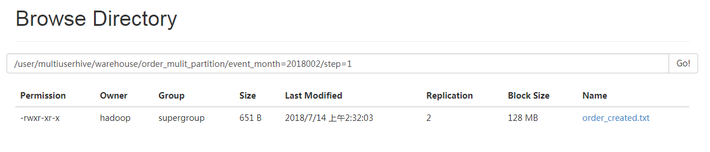

#### Hive分区表

##### 1.静态单机分区表

```
##创建一张表
hive> create table order_partition
    > (
    > order_number string,
    > event_time string
    > )
    > partitioned by (event_month string)
    > row format delimited fields terminated by '\t'
    > ;
##加载数据
hive> load data local inpath '/home/hadoop/testData/order_created.txt'
    > overwrite into table order_partition 
    > partition(event_month='2018-001')
    > ;
##读取数据
hive> select * from order_partition;
OK
1	2018-06-21 20:00:51.037826860	2018-001
2	2018-06-22 03:04:51.040970206	2018-001
3	2018-06-22 20:39:51.034481252	2018-001
4	2018-06-24 09:09:51.022637290	2018-001
5	2018-06-26 06:50:51.060693942	2018-001
6	2018-06-28 14:26:51.051826824	2018-001
7	2018-06-30 11:21:51.019808578	2018-001
8	2018-07-01 13:06:51.057696634	2018-001
9	2018-07-02 13:43:51.016529320	2018-001
10	2018-07-03 20:02:51.007819972	2018-001
11	2018-07-04 15:17:51.069097035	2018-001
12	2018-07-06 09:01:51.072613612	2018-001
13	2018-07-06 20:46:51.029663253	2018-001
14	2018-07-07 10:10:51.064659809	2018-001
15	2018-07-07 21:33:51.044516187	2018-001
16	2018-07-09 03:55:51.011026107	2018-001
17	2018-07-09 11:41:51.054746747	2018-001
18	2018-07-11 23:15:51.004664544	2018-001
19	2018-07-12 23:31:51.025437365	2018-001
20	2018-07-13 15:02:51.048536252	2018-001
Time taken: 0.512 seconds, Fetched: 20 row(s)

##发现
hive> desc order_partition;
OK
order_number        	string              	                    
event_time          	string              	                    
event_month         	string              	                    
	 	 
# Partition Information	 	 
# col_name            	data_type           	comment             
	 	 
event_month         	string  
在Hive表中，能查到分区列的数据，但是在HDFS的数据表中查不到分区列的数据 
因为：分区列不是表中的一个实际的列，其实质是一个伪列，而HDFS中存储的是真正的数据，因此肯定看不到该列

```

##### 2.静态多级分区表

```
##创建表
hive> create table order_mulit_partition(
    > order_number string,
    > event_time string
    > )
    > partitioned by (event_month string,step string)
    > row format delimited fields terminated by '\t'
    > ;
##加载数据
hive> load data local inpath '/home/hadoop/testData/order_created.txt' 
    > overwrite into table order_mulit_partition
    > partition(event_month='2018002',step='1')
    > ;
```

集群中数据存放位置：



##### 3.需求：按照不同部门作为分区导入数据到目标表

一、使用静态分区表来完成

```
##创建表emp
hive> create table emp(
    > empno int,
    > ename string,
    > job string,
    > mgr int,
    > hiredate string,
    > sal double,
    > comm double,
    > deptno int)
    > row format delimited fields terminated by ' '
    > ;
##加载数据
hive> load data local inpath '/home/hadoop/testData/order_created3.txt'
    > overwrite into table emp;
##表emp数据格式如下
hive> select * from emp;
OK
123	cc	MM	123	1981-6-9	23.0	NULL	10
123	cc	MM	123	1981-6-9	23.0	NULL	10
123	cc	MM	123	1981-6-9	23.0	NULL	10
123	cc	MM	123	1981-6-9	23.0	NULL	10
123	cc	MM	123	1981-6-9	23.0	NULL	10
123	cc	MM	123	1981-6-9	23.0	NULL	10
123	cc	MM	123	1981-6-9	23.0	NULL	10
123	cc	MM	123	1981-6-9	23.0	NULL	10
123	cc	MM	123	1981-6-9	23.0	NULL	10

##创建静态分区表emp_static_partition
hive> create table emp_static_partition(
    > empno int,
    > ename string,
    > job string,
    > mgr int,
    > hiredate string,
    > sal double,
    > comm double)
    > partitioned by(deptno int)
    > row format delimited fields terminated by ' '
    > ;
##插入数据
hive> insert into table emp_static_partition partition(deptno=10)
    > select empno,ename,job,mgr,hiredate,sal,comm 
    > from emp
    > where deptno=10;
##查询数据
hive> select * from emp_static_partition;
OK
123	cc	MM	123	1981-6-9	23.0	NULL	10
123	cc	MM	123	1981-6-9	23.0	NULL	10
123	cc	MM	123	1981-6-9	23.0	NULL	10
123	cc	MM	123	1981-6-9	23.0	NULL	10
123	cc	MM	123	1981-6-9	23.0	NULL	10
123	cc	MM	123	1981-6-9	23.0	NULL	10
123	cc	MM	123	1981-6-9	23.0	NULL	10
123	cc	MM	123	1981-6-9	23.0	NULL	10
123	cc	MM	123	1981-6-9	23.0	NULL	10
```

二、使用动态分区表完成

```
##创建动态分区表
hive> create table emp_dynamic_partition(
    > empno int,
    > ename string,
    > job string,
    > mgr int,
    > hiredate string,
    > dal double,
    > comm double)
    > partitioned by (deptno int)
    > row format delimited fields terminated by ' '
    > ;
【注意】动态分区表与静态分区表的创建，在语法上是没有任何区别的
##插入数据需要设置属性的值，不设置会报错
hive> insert into table emp_dynamic_partition partition(deptno)
    > select * from emp;
FAILED: SemanticException [Error 10096]: Dynamic partition strict mode requires at least one static partition column. To turn this off set hive.exec.dynamic.partition.mode=nonstrict

hive> set hive.exec.dynamic.partition.mode=nonstrict;
hive> insert into table emp_dynamic_partition partition(deptno)
    > select * from emp;
【注意】分区的字段名称，写在最后，有几个就写几个 与静态分区相比，不需要where了
##查询数据
hive> select * from emp_dynamic_partition;
OK
123	cc	MM	123	1981-6-9	23.0	NULL	10
123	cc	MM	123	1981-6-9	23.0	NULL	10
123	cc	MM	123	1981-6-9	23.0	NULL	10
123	cc	MM	123	1981-6-9	23.0	NULL	10
123	cc	MM	123	1981-6-9	23.0	NULL	10
123	cc	MM	123	1981-6-9	23.0	NULL	10
123	cc	MM	123	1981-6-9	23.0	NULL	10
123	cc	MM	123	1981-6-9	23.0	NULL	10

##################################################
动态分区表总结：
动态分区无需手工指定数据导入的具体分区 
而是由select的字段(字段写在最后，有几个写几个)自行决定导出到哪一个分区中 
并自动创建相应的分区，使用上更加方便快捷 
工作中用的非常多

```

