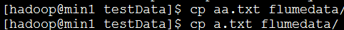
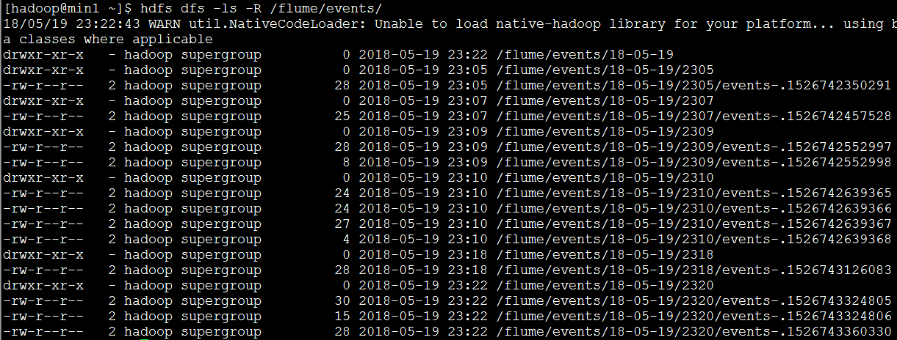
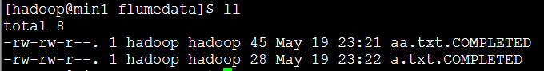

#### flume案例：spooldir+hdfs

就是对目录进行监控，并将监控结果下沉到hdfs系统中

注意：

1.不能直接在监控目录下直接写文件

2.不能将同名的文件放到监控目录下

- 配置sources,channels,sinks文件

  ```
  #首先在flume-1.6.0/agentconf下创建配置文件spooldir-hdfs.conf
  vi agentconf/spooldir-hdfs.conf
  #给sources,sinks,channels起名字
  a1.sources=r1
  a1.sinks=k1
  a1.channels=c1
  #配置sources的属性
  a1.sources.r1.type=spooldir
  a1.sources.r1.spoolDir=hdfs://192.168.216.11:9000/home/hadoop/testData/flumedata    ##监控的本地目录
  a1.sources.r1.fileHeader=true ##？？是否添加文件头
  #配置sink属性
  a1.sinks.k1.type=hdfs
  a1.sinks.k1.hdfs.path=/flume/events/%y-%m-%d/%H%M/
  a1.sinks.k1.hdfs.filePrefix=events-
  a1.sinks.k1.hdfs.round=true
  a1.sinks.k1.hdfs.roundValue=10
  a1.sinks.k1.hdfs.roundUnit=second
  a1.sinks.k1.hdfs.rollInterval=3
  a1.sinks.k1.hdfs.rollSize=20
  a1.sinks.k1.hdfs.roolCount=5
  a1.sinks.k1.hdfs.batchSize=1
  a1.sinks.k1.hdfs.useLocalTimeStamp=true
  a1.sinks.k1.hdfs.fileType=DataStream
  #配置channels属性
  a1.channels.c1.type=memory
  a1.channels.c1.capacity=1000
  a1.channels.c1.transactionCapacity=100
  #将channel与sources,sinks联系起来
  a1.sources.r1.channels=c1
  a1.sinks.k1.channel=c1
  ```

- 开启agent

  ```
  bin/flume-ng agent -c ./conf -f agentconf/spooldir-hdfs.conf -n a1 -Dflume.root.logger=INFO,console
  ```

- 测试

  将文件拷贝到监控目录

  

  - 查看结果

  1.hdfs系统中产生的文件

  

  2.监控目录下文件的状态

  

  注意：.COMPLETED表示该文件已经被监控

  ​