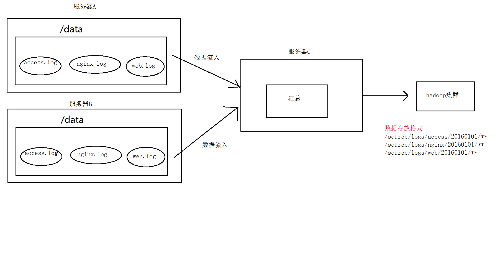

#### flume案例：日志采集和汇总

1. ##### 案例场景

   min1、min2两台日志服务机器实时生产日志主要类型为access.log、nginx.log、web.log 

   现在要求：

   把min1、min2 机器中的access.log、nginx.log、web.log 采集汇总到min3机器上然后统一收集到hdfs中。

   但是在hdfs中要求的目录为：

   /source/logs/access/20160101/**

   /source/logs/nginx/20160101/**

   /source/logs/web/20160101/**

2. ##### 场景分析

   ##### 

3. ##### 数据流处理分析

   ##### 

4. ##### 配置文件

5. ##### 开启服务

6. ##### 查看数据传输结果